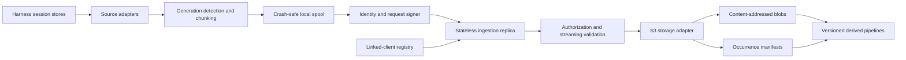

# Agent Archivist implementation plan

Status: proposed execution plan · Last updated: 2026-09-08

This plan turns the [research findings](../research/transcript-archiving-findings.md)
and [system requirements](../notes/requirements.md) into an implementation and
release sequence. It is deliberately more concrete than the research document.
When this plan and the normative requirements disagree, the requirements win until
an explicit requirements change is reviewed and committed.

## 1. Outcome

Build and publish a production-capable system that:

1. discovers durable coding-agent sessions on linked clients;
2. incrementally captures active and historical sessions without losing provenance;
3. authenticates every uploader and validates every submitted artifact;
4. stores content-addressed blobs and occurrence manifests in S3-compatible storage;
5. converges safely after retries without server-local durable state;
6. supports ARMOR backed by B2 without making either one mandatory;
7. reports measurable archive coverage without logging transcript content; and
8. exposes a versioned raw corpus for separately governed reflection, evaluation,
   retrieval, and dataset pipelines.

The first production-ready release is complete only when the baseline acceptance
criteria in the requirements document pass against a reference S3 implementation
and the B2 compatibility profile.

## 2. Scope boundaries

### In scope for the first production-ready release

- A portable host client with durable cursor and spool state.
- First-party adapters for Claude Code, Codex, OpenCode, and Pi.
- A versioned ingest protocol and machine-readable schemas.
- Proof-of-possession authentication for linked clients.
- A stateless, horizontally scalable ingestion server.
- A portable S3 storage adapter and explicit backend capability reporting.
- Deterministic logical deduplication of blobs and occurrences.
- Docker, local Compose, Helm, and Linux service packaging.
- Content-free status, metrics, structured errors, and health endpoints.
- Synthetic conformance, integration, fault-injection, and compatibility tests.
- A migration path from deployment-specific collectors without importing their Git
  history or configuration into this repository.

### Deferred until the raw archive is reliable

- Automatic semantic summarization or memory injection.
- Training or fine-tuning pipelines.
- A hosted multi-tenant control-plane UI.
- Full-text search, embeddings, knowledge graphs, and episode generation.
- Automated deletion of shared blobs without a proven mark-and-sweep design.
- Guaranteed physical exactly-once writes on storage without atomic conditional
  create.
- A universal transparent provider proxy. Exact inference capture will begin as an
  optional integration with explicit coverage limits.

### Non-goals

- Replacing the agent harness's own session UX.
- Treating orchestrator logs as a substitute for harness transcripts.
- Giving clients general-purpose S3 credentials.
- Copying complete harness databases or credential stores.
- Making raw transcripts safe to prompt from merely because they are archived.
- Requiring Kubernetes, ARMOR, B2, or any single cloud provider.

## 3. Decisions already fixed

The following decisions are architectural constraints, not phase-level options:

- The ingestion data plane is stateless between requests.
- S3-compatible object storage is the durable source of truth.
- Clients own discovery cursors, pending spools, retry schedules, and acknowledgements.
- A client installation has a persistent cryptographic identity; hostname is only
  mutable provenance.
- Logical session identity is tenant + origin client + harness + upstream session.
- Blob identity and occurrence identity are separate.
- Raw blobs are addressed by SHA-256 of canonical uncompressed payload bytes.
- Object keys are tenant-scoped and derived by the server.
- Retries reuse byte-identical envelopes and deterministic identities.
- Largest histories receive backfill priority, with freshness and fairness quotas.
- Raw, catalog, and derived namespaces remain separate and versioned.
- Operational telemetry never includes transcript bodies or authentication material.
- The public project uses only synthetic fixtures and independent Git history.

Changing one of these decisions requires updating the research, requirements, and
this plan together.

## 4. Proposed implementation baseline

The initial implementation should be a Rust workspace. Rust provides portable
single binaries for host installation, bounded-memory streaming, shared protocol
types between client and server, and strong testability for state transitions.

Proposed components:

- Tokio for asynchronous I/O and cancellation.
- Axum and Tower for the HTTP server and middleware.
- Serde for protocol types and canonical manifest serialization.
- AWS SDK for Rust behind a narrow internal S3 trait.
- SQLite in WAL mode for client state only.
- Clap for the command-line interface.
- Tracing and OpenTelemetry-compatible exporters with content-safe fields.
- Ed25519 client keys unless the Phase 1 authentication ADR selects a better
  interoperable proof-of-possession mechanism.

Library selection is not an excuse to expose SDK types across crate boundaries.
Protocol, storage, adapter, and state-machine interfaces must remain owned by this
project so an implementation can be replaced without changing the wire contract.

## 5. Target architecture



### Client data flow

1. Discover configured accounts and source roots through adapters.
2. Inventory outstanding bytes or events without copying transcript content into
   logs or status.
3. Detect source generation and select complete record boundaries.
4. Materialize an immutable canonical chunk in a mode-restricted spool.
5. Calculate the canonical uncompressed digest and deterministic occurrence ID.
6. Freeze and sign the upload envelope. Retries never regenerate timestamps or IDs.
7. Upload according to the freshness/backfill scheduler.
8. Validate the authenticated receipt and atomically advance local acknowledgement
   state.
9. Remove the acknowledged spool object only after the state transaction commits.

### Server data flow

1. Bound request headers, envelope size, body size, duration, and concurrency.
2. Authenticate the uploader and load its linked-client authorization record.
3. Verify signature, tenant, origin delegation, timestamp, and replay policy.
4. Validate schema, identifiers, source coordinates, encoding, and declared digest.
5. Stream-decompress and hash the body while writing uncommitted multipart data.
6. Abort the write if size, expansion ratio, media, or digest validation fails.
7. Commit the blob using the backend's strongest supported idempotency primitive.
8. Write the deterministic occurrence manifest after the blob is durable.
9. Return an authenticated receipt describing only the guarantee actually achieved.

If the process exits after the blob commit but before the occurrence commit, an
identical retry checks or rewrites the same blob and completes the same occurrence.
No server-side recovery queue is required.

### Control-plane boundary

Linking and revocation are control-plane operations. The initial control plane is an
administrator CLI that writes signed client authorization records to a dedicated S3
prefix. The server may cache those records in memory, but the cache is disposable
and cannot be authoritative.

A later web or OIDC linking service may replace the administrator CLI without
changing client identity or the ingestion protocol.

## 6. Planned repository structure

```text
agent-archivist/
├── Cargo.toml
├── Cargo.lock
├── crates/
│   ├── archivist-protocol/       # wire types, validation, IDs, key derivation
│   ├── archivist-storage/        # storage trait and capability model
│   ├── archivist-storage-s3/     # portable S3 implementation
│   ├── archivist-auth/           # signing, verification, linked-client records
│   ├── archivist-client-core/    # cursor, spool, scheduler, upload state machine
│   ├── archivist-adapter-sdk/    # discovery and immutable artifact interfaces
│   ├── archivist-adapter-claude/
│   ├── archivist-adapter-codex/
│   ├── archivist-adapter-opencode/
│   ├── archivist-adapter-pi/
│   ├── archivist-server/         # stateless HTTP data plane
│   └── archivist-cli/            # collect, serve, link, admin, status commands
├── schemas/
│   └── v1/                       # checked-in JSON schemas and examples
├── fixtures/
│   └── synthetic/                # generated, non-sensitive conformance corpus
├── tests/
│   ├── conformance/
│   ├── compatibility/
│   ├── fault-injection/
│   └── end-to-end/
├── deploy/
│   ├── compose/
│   ├── helm/
│   └── systemd/
├── docs/
│   ├── adr/
│   ├── notes/
│   ├── plan/
│   ├── protocol/
│   ├── research/
│   ├── security/
│   └── operations/
└── tools/                         # fixture generation and compatibility runners
```

The final number of crates may be reduced after interfaces stabilize. Adapter crates
remain separate so harness-specific dependencies and schema churn do not leak into
the server or protocol core.

## 7. Contract design

### 7.1 Version axes

Version these dimensions independently:

| Dimension | Initial form | Compatibility rule |
|---|---|---|
| HTTP route | `/v1/ingest` | Breaking wire changes use a new route major |
| Envelope schema | `envelope_version` | Unknown major fails closed |
| Occurrence schema | `occurrence_version` | Readers retain old-version support |
| Storage layout | `v1` key prefix | Never silently repurpose an existing prefix |
| Adapter projection | adapter + projection version | Preserve the version in provenance |
| Derived pipeline | pipeline name + version | Rebuildable; never overwrites raw data |

Software packages use semantic versioning, but package version is not a substitute
for any data-format version.

### 7.2 Envelope fields

The Phase 1 schema must define at least:

- protocol and envelope versions;
- tenant, origin client, and uploader client IDs;
- harness, upstream session ID, artifact kind, and adapter projection version;
- artifact identity, source generation, byte/event range, and ordering fields;
- canonical uncompressed SHA-256, compressed representation checksum, and encoding;
- compressed and uncompressed sizes;
- source, capture, and envelope creation timestamps;
- deterministic occurrence ID and unique request ID;
- optional parent session, orchestrator attempt, trace, and inference request IDs;
- signing key ID, authorization epoch, and detached signature.

The immutable spooled envelope must exclude server commit time and other values that
would change across retries.

### 7.3 Object keys

The first ADR should refine this logical layout:

```text
tenants/<tenant>/v1/raw/blobs/sha256/<digest-prefix>/<digest>.zst
tenants/<tenant>/v1/raw/occurrences/<origin>/<harness>/<session-shard>/<session-hash>/<occurrence>.json
tenants/<tenant>/v1/control/clients/<client>.json
tenants/<tenant>/v1/control/revocations/<client>/<epoch>.json
tenants/<tenant>/v1/catalog/checkpoints/<checkpoint>.json
tenants/<tenant>/v1/derived/<pipeline>/<version>/<partition>/<object>
```

Raw upstream session IDs should be hashed for object-key safety and privacy. The
occurrence manifest retains the original identifier when tenant policy permits it.
All key segments are generated from validated opaque IDs or hashes; source file
paths and hostnames never become unsanitized object-key components.

### 7.4 Commit abstraction

The storage crate needs an explicit capability model instead of assuming AWS S3
semantics:

```text
conditional_create: supported | emulated_single_writer | unavailable
multipart_abort: supported | unavailable
stored_checksum: sha256 | md5 | provider_specific | unavailable
versioning: enabled | disabled | unknown
server_side_encryption: required | supported | unavailable
```

The server selects one of these honest outcomes:

- `created`
- `already_present`
- `replaced_equivalent`
- `logically_committed_unknown_physical_result`

An existing content-addressed key with incompatible digest, length, encoding, or
schema metadata is a hard integrity failure, not a successful deduplication.

### 7.5 Chunking policy

Chunk sizes and compression are finalized through benchmarks in Phase 1. The
initial experiment should compare 8, 16, and 32 MiB uncompressed targets and define
a separate hard limit for a single oversized record.

Every adapter must document whether it chunks by:

- complete JSONL record boundaries;
- database event/message boundaries;
- immutable source object; or
- provider request/response event boundary.

Chunks never split a structured record merely to hit the target size. Oversized
records receive an explicit status and bounded handling path rather than silent
truncation.

## 8. Delivery phases

Each phase ends with a committed artifact and an objective exit gate. Later phases
may prototype against unstable interfaces, but no phase is considered complete
until its dependencies' gates pass.

### Phase 0 — Project foundation and decision framework

Deliverables:

- Create the Rust workspace and crate skeletons without placeholder production
  behavior.
- Add `CONTRIBUTING.md`, `SECURITY.md`, support policy, code of conduct, and release
  process.
- Add formatting, Clippy, unit-test, documentation, dependency-audit, license, and
  secret-scanning checks.
- Define the ADR template and requirement-to-test traceability format.
- Add a deterministic synthetic fixture generator; do not hand-copy real sessions.
- Establish conventional configuration, error-code, and metrics naming.
- Document supported Rust version and reproducible local development commands.

Exit gate:

- A clean checkout runs all baseline checks with no external credentials.
- Generated fixtures reproduce byte-for-byte from a recorded seed.
- Every planned crate has an owner/purpose statement and no circular dependency.

### Phase 1 — Protocol, identity, and storage ADRs

Write and decide these ADRs before production implementation:

1. Request framing and signature canonicalization.
2. Client key algorithm, key rotation, authorization epoch, and replay window.
3. Canonical raw bytes, deterministic compression, chunk targets, and hard limits.
4. Session namespace, generation rules, occurrence ID, and exact key derivation.
5. Minimum portable S3 contract and optional backend capabilities.
6. Linked-client registry, delegation, revocation, and cache behavior.
7. Receipt authentication and durable client acknowledgement semantics.

Deliverables:

- Versioned envelope, occurrence, linked-client record, revocation, error, and
  receipt schemas.
- Normative protocol and storage-layout documents.
- Golden valid/invalid envelopes and deterministic ID/key vectors.
- A small language-neutral conformance corpus containing expected signatures,
  digests, and object keys.
- A threat model covering spoofing, replay, cross-tenant writes, digest confusion,
  decompression bombs, poisoned manifests, and metadata leakage.

Exit gate:

- Two independent implementations or one implementation plus a standalone fixture
  verifier produce identical signatures, IDs, and keys.
- Every field has bounds, normalization rules, and a compatibility rule.
- The threat model has a mitigation or explicitly accepted risk for every finding.

### Phase 2 — Storage core and backend compatibility

Deliverables:

- Define a storage trait with begin/write/commit/abort semantics.
- Implement the portable S3 adapter with endpoint, region, path-style, TLS, and
  encryption configuration.
- Implement content-addressed blob commit and deterministic occurrence-manifest
  commit.
- Add capability probing that does not mutate arbitrary keys and caches only
  advisory results.
- Add synthetic compatibility tests for conditional create, concurrent writers,
  multipart abort, checksums, versioning, and equivalent overwrite.
- Test a local reference backend, B2, and the ARMOR S3 path.
- Document lifecycle recommendations for noncurrent duplicate versions.

Exit gate:

- Repeated and concurrent writes converge to one logical blob and occurrence on
  every supported profile.
- Reports distinguish logical from physical deduplication truthfully.
- Invalid or interrupted multipart uploads leave no committed content-addressed
  object and are cleanable through documented lifecycle policy.
- All backend-specific behavior is isolated in storage adapters.

### Phase 3 — Client identity and linking control plane

Deliverables:

- Generate client ID and signing keys locally with restrictive filesystem modes.
- Implement key discovery without printing private key material.
- Implement a link request that exposes only public identity and requested scope.
- Implement administrator approval and revocation commands backed by signed S3
  control records.
- Implement origin/uploader delegation for approved relays.
- Implement key rotation with overlapping verification and monotonic authorization
  epochs.
- Define revocation cache TTL and the maximum revocation propagation delay.

Exit gate:

- Unlinked, revoked, stale-epoch, cross-tenant, altered, replay-expired, and
  unauthorized relay requests fail closed.
- Rotation does not strand already spooled requests inside the documented overlap.
- No command logs or prints private keys or authorization values.
- Replacing every server replica does not lose link or revocation state.

### Phase 4 — Stateless ingestion server

Deliverables:

- Implement `/health/live`, `/health/ready`, `/metrics`, and `/v1/ingest`.
- Add bounded parsing, authorization, validation, rate limiting, and concurrency
  limiting middleware.
- Stream the payload through decompression, uncompressed hashing, stored-byte
  checksum, and the storage commit abstraction.
- Commit blob before occurrence and issue a receipt only after both are durable.
- Return stable JSON error codes without echoing user content.
- Add graceful shutdown that aborts unfinished multipart uploads.
- Add content-safe structured logging and low-cardinality metrics.
- Publish a non-root, minimal container with an SBOM and pinned base image.

Exit gate:

- Two or more replicas pass identical-request and concurrent-retry tests without
  shared process state or sticky routing.
- Forced termination at every commit boundary converges correctly after retry.
- Memory use is bounded by configured concurrency and multipart buffers, not total
  payload size.
- Fuzzed envelopes and compressed streams do not panic, over-allocate, or commit
  invalid objects.

### Phase 5 — Durable client engine

Deliverables:

- Implement configuration discovery and validation with no secrets in CLI arguments.
- Implement SQLite migrations for sources, generations, ranges, spool entries,
  requests, receipts, and adapter health.
- Implement atomic spool write, file synchronization, rename, acknowledgement, and
  cleanup transitions.
- Implement frozen signed envelopes and idempotent retry with exponential backoff
  and jitter.
- Implement source inventory and the two-lane freshness/backfill scheduler.
- Rank historical accounts by measured outstanding data while applying per-source
  byte/time quotas.
- Add disk high-water/low-water behavior and explicit degraded status.
- Implement `inventory`, `run --once`, `daemon`, `status --json`, and `verify-state`
  commands.

Exit gate:

- Crash injection between every local state transition produces neither loss nor
  an acknowledged-but-uncommitted range.
- A month-scale synthetic marathon session advances incrementally and resumes after
  restart.
- An unavailable server cannot grow the spool past policy without a visible error.
- Scheduler tests prove both largest-first progress and bounded starvation.

### Phase 6 — Harness adapters

Use the adapter SDK to keep discovery, source parsing, generation detection, and
projection versioning separate from transport.

#### 6A. Claude Code and Codex

- Discover default and explicitly configured account/source roots.
- Parse JSONL only on complete record boundaries.
- Capture related sidecars as separate artifact kinds with explicit relationships.
- Detect inode/file identity changes, truncation, tail mismatch, and rewrite.
- Preserve harness and upstream session IDs without treating either as global.

These adapters ship first because file-based capture exercises marathon chunking
and they are expected to represent the largest initial histories. Actual scheduling
still uses measured backlog rather than a hard-coded harness preference.

#### 6B. OpenCode

- Open the supported database read-only with a bounded busy timeout.
- Detect schema version before querying.
- Project only allowlisted session, message, part, input, and task fields.
- Exclude account, token, credential, provider-auth, and unrelated cache tables.
- Verify large fields against direct database reads so export truncation is caught.

#### 6C. Pi

- Discover configured roots and supported durable session formats.
- Report no-session/ephemeral mode as a coverage gap.
- Apply the same complete-record, generation, and sidecar rules as appropriate.

#### 6D. Adapter SDK and community adapters

- Publish adapter lifecycle, capability, status, and projection interfaces.
- Provide a synthetic adapter example and conformance suite.
- Define compatibility rules so an adapter can release independently later without
  destabilizing the core wire format.

Exit gate:

- Each adapter passes golden projection tests, active-growth tests, source
  replacement tests, permission-error tests, and missing-root tests.
- Database adapters prove through allowlist tests that credential tables cannot be
  projected.
- A multi-account synthetic inventory backfills largest outstanding histories first
  while keeping every adapter fresh.
- Coverage status differentiates absent, unsupported, failed, partial, current, and
  fully backfilled.

### Phase 7 — Packaging, deployment, and operations

Deliverables:

- Produce signed release binaries for supported Linux architectures and macOS when
  runner support exists.
- Provide a Linux user service and timer/daemon configuration with secure defaults.
- Provide local Compose with a reference S3 service and synthetic smoke test.
- Provide a Helm chart supporting replicas, resources, disruption budget,
  autoscaling, network policy, service monitor, and secret references.
- Document direct S3, B2, ARMOR, and self-hosted S3 profiles.
- Add runbooks for linking, revocation, key rotation, stalled clients, storage
  errors, lifecycle cleanup, restore verification, and schema upgrades.
- Define content-free dashboards and alerts for freshness, pending bytes, failure
  rate, validation failures, and storage latency.

Exit gate:

- A new operator can deploy local Compose, link a synthetic client, ingest a
  session, destroy the server, redeploy it, and continue without data loss.
- A multi-replica Helm deployment passes the end-to-end retry suite.
- Secret scanning confirms examples and built artifacts contain no live values.
- Backup/replication and a byte-verified restore are demonstrated and documented.

### Phase 8 — Pilot and migration

The existing deployment-specific collectors remain the rollback path until the new
system proves equivalent or better. No private source or archive history is copied
into this public repository.

Deliverables:

- Build a read-only inventory comparator that compares counts, ranges, and hashes
  without exporting content into logs.
- Deploy one linked client in shadow mode to a versioned pilot prefix.
- Verify active-session freshness, crash recovery, relay provenance, and server
  replacement.
- Expand to clients with the largest measured histories first, while retaining
  freshness reservations and quotas.
- Run the old and new collectors together long enough to observe at least two full
  scheduling cycles and forced failure recovery.
- Reconcile unexplained coverage differences before changing the source of record.
- Freeze legacy writes only after the new archive passes restore verification.
- Preserve the legacy archive read-only for its retention period; do not rewrite or
  delete it as part of cutover.

Exit gate:

- Every configured source has an explicit coverage status and no unexplained gap.
- Sampled source ranges restore byte-identically from the new raw blob objects.
- Duplicate retries and overlapping legacy collection do not erase provenance.
- Operators have exercised rollback and documented the exact cutover state.

### Phase 9 — Exact inference and orchestrator correlation

Deliverables:

- Define artifact kinds for provider request, provider response, streaming event,
  retry, usage, and transport error.
- Add an optional OpenAI-compatible proxy or SDK hook that preserves provider
  boundaries and never claims support for unobserved traffic.
- Define trace and request identifiers that join inference artifacts to harness
  sessions and orchestrator attempts.
- Have orchestrators reference canonical occurrence IDs rather than uploading a
  second canonical transcript.
- Add flush-before-teardown integration for ephemeral jobs and report incomplete
  flushes explicitly.

Exit gate:

- Tests show the distinction between semantic harness transcripts and exact wire
  capture.
- Retry/stream ordering is reconstructable without merging two provider attempts.
- Ephemeral-job completion is gated on an acknowledged flush when complete capture
  is required.

### Phase 10 — Derived catalog, governance, and safe consumption

This phase does not alter the ingest data plane.

Deliverables:

- Build a deterministic catalog job from occurrence manifests.
- Produce versioned Parquet inventories and completeness reports.
- Define occurrence tombstones and a grace-period mark-and-sweep design for shared
  blobs.
- Add export and deletion workflows with audit records.
- Define a redacted episode schema with raw occurrence provenance.
- Add prompt-injection classification and human policy gates before any archive
  material can be used by an agent.

Exit gate:

- Catalogs rebuild byte-identically from the same raw prefix and pipeline version.
- A deletion simulation never removes a blob with a retained occurrence.
- Derived data can be traced to raw occurrences without exposing raw object paths to
  unauthorized consumers.
- No raw transcript enters an agent context in the default installation.

### Phase 11 — Production hardening and 1.0

Deliverables:

- Complete external security review or a documented independent threat-model review.
- Run dependency, license, secret, container, and supply-chain scans on releases.
- Fuzz protocol parsing, decompression, key derivation, adapter projections, and
  SQLite recovery.
- Run sustained load and soak tests with multiple replicas and clients.
- Verify schema forward/backward compatibility and rollback from the release
  candidate.
- Publish compatibility matrix, limitations, support window, and security response
  process.

Exit gate:

- Every baseline requirement has a passing automated test or an explicitly reviewed
  operational verification.
- No unresolved critical/high security finding remains.
- The release candidate survives the defined soak, fault-injection, restore, and
  downgrade tests.
- Documentation enables an independent operator to deploy and recover the system.

## 9. Dependency order and parallel work

| Work item | Depends on | Can proceed in parallel with |
|---|---|---|
| Foundation | Current docs | Nothing initially |
| Protocol schemas and ADRs | Foundation | Threat model, fixture generator |
| Storage adapter | Key/layout ADRs | Auth library, client state model |
| Auth/control records | Auth ADR, schemas | Storage compatibility, client spool |
| Ingestion server | Protocol, storage, auth | Client scheduler after protocol freeze |
| Client engine | Protocol, receipt semantics | Server implementation |
| Claude/Codex adapters | Adapter SDK, client state | Server hardening |
| OpenCode/Pi adapters | Adapter SDK | Packaging, compatibility expansion |
| Packaging | Working server and client | Adapter completion, runbooks |
| Pilot migration | End-to-end release candidate | Exact-inference design |
| Derived pipelines | Stable occurrence schema | Production hardening |

The critical path is:

```text
foundation → protocol decisions → storage/auth → server + client → adapters
→ deployment → pilot → production hardening
```

Avoid parallel implementation of competing object layouts or signing formats after
Phase 1. Parallelize behind settled interfaces instead.

## 10. Verification strategy

### Unit and property tests

- Identifier parsing, normalization, bounds, and key derivation.
- Deterministic occurrence IDs and serialization.
- Chunk boundary selection and oversized-record behavior.
- Generation transitions for append, truncate, replace, and rewrite.
- Scheduler priority, quotas, freshness reservation, and starvation bounds.
- Authorization, delegation, rotation, revocation, and replay windows.
- State-machine invariants for spool and acknowledgements.

Property tests should assert that arbitrary identifiers cannot escape tenant prefixes,
reordering fields cannot change canonical meaning silently, and a cursor never moves
beyond its highest durable receipt.

### Protocol conformance tests

- Golden signed envelopes and receipts.
- Required/unknown/malformed field behavior.
- Cross-version reader behavior.
- Content-length, decompressed-length, digest, and checksum mismatch.
- Duplicate request and duplicate occurrence behavior.
- Existing blob with incompatible metadata.

### Fault-injection tests

Terminate or fail at each boundary:

1. before local spool rename;
2. after spool rename but before SQLite transaction;
3. during request streaming;
4. after multipart parts but before blob commit;
5. after blob commit but before occurrence commit;
6. after occurrence commit but before receipt delivery;
7. after receipt delivery but before local acknowledgement; and
8. after acknowledgement but before spool cleanup.

Every case must converge without content loss or duplicate logical occurrences.

### Storage compatibility tests

Run the same black-box suite against:

- the local reference S3 implementation on every full verification run;
- B2 on an isolated synthetic prefix before compatible releases;
- ARMOR's S3 path before deployment there; and
- optional AWS S3, Garage, or other community-supported profiles.

The test report records capabilities and observed physical versions. It must not
convert an unknown result into a stronger guarantee.

### Adapter tests

- Synthetic normal, large, malformed, partially written, and rewritten sessions.
- Versioned database schema fixtures without any real account data.
- Permission-denied, disappearing source, concurrent writer, and locked database.
- Projection allowlist checks that fail when new source columns appear unexpectedly.
- Round-trip comparison between source artifact and reconstructed canonical chunks.

### Load and soak tests

- Many small active sessions and several large marathon sessions concurrently.
- Multiple clients retrying through at least two stateless replicas.
- Storage latency, transient failure, throttling, and lost responses.
- Bounded server memory and bounded client disk under outage.
- Long enough execution to cross credential rotation and revocation-cache refresh.

Performance numbers should be recorded as benchmark evidence, not promoted to SLOs
until representative deployment measurements exist.

## 11. Security and privacy workstream

Security is part of every phase, not a final audit task.

Required controls:

- Threat-model updates for each new externally reachable endpoint or adapter.
- No transcript body, prompt, response, tool output, key, or credential in logs,
  metrics, traces, panics, fixtures, snapshots, or CLI arguments.
- Tenant authorization before object-key construction or storage calls.
- Constant-time signature verification through reviewed cryptographic libraries.
- Tight limits on identifiers, envelope size, body size, expansion ratio, duration,
  concurrent uploads, and multipart resources.
- Storage encryption required by configuration validation.
- Mode-restricted client state and explicit refusal when permissions are unsafe.
- Source-root allowlists and clearly documented adapter capture boundaries.
- Dependency pinning, SBOMs, vulnerability response, and release provenance.
- Raw-data access separated from derived-data access.
- Restore, export, retention, legal-hold, and deletion audit procedures.

Before enabling inference capture, document the additional risk of centralizing raw
provider inputs, outputs, headers, and error bodies. Provider credentials must never
become archive metadata.

## 12. Observability and operational signals

### Client status

Expose per adapter/account without session text or raw paths:

- discovery state and adapter version;
- discovered, spooled, pending, acknowledged, and failed counts/bytes;
- estimated historical bytes remaining;
- oldest pending and newest acknowledged timestamps;
- active source count and freshness lag;
- last successful inventory/upload and classified last error;
- current spool use, configured limit, and degraded reason; and
- coverage state: missing, unsupported, failed, partial, current, or backfilled.

### Server signals

- request count and accepted compressed/uncompressed bytes;
- authorization and validation failure counts by bounded error code;
- storage operation latency and error class;
- blob/occurrence commit outcome;
- multipart abort failures;
- in-flight requests, concurrency rejection, and graceful-shutdown drain;
- trust-registry refresh age and failure; and
- receipt outcome.

Do not label metrics with session ID, client hostname, source path, digest, request
ID, or other unbounded/sensitive values by default.

### Initial operational objectives

Before 1.0, establish measured targets for:

- zero acknowledged-but-unrecoverable chunks in fault-injection testing;
- deterministic convergence after one successful retry;
- freshness lag relative to configured collection interval;
- backfill progress under the largest supported corpus;
- revocation propagation within the documented maximum; and
- restore success from every supported storage profile.

## 13. Release sequence

| Release | Purpose | Minimum contents |
|---|---|---|
| `0.1` | Protocol preview | Schemas, ADRs, conformance vectors, threat model |
| `0.2` | End-to-end developer preview | S3 adapter, server, client core, synthetic adapter |
| `0.3` | Host capture alpha | Claude/Codex adapters, durable spool, status |
| `0.4` | Adapter and backend beta | OpenCode/Pi, B2/ARMOR compatibility, packaging |
| `0.5` | Operational beta | Helm/Compose/services, rotation, runbooks, fault tests |
| `0.6` | Migration candidate | Shadow comparator, pilot evidence, restore verification |
| `0.7+` | Hardening candidates | Inference integration, governance work, audit fixes |
| `1.0` | Stable raw archive | All baseline requirements and compatibility gates pass |

No release is called production-ready solely because all crates compile. Release
notes must state supported adapters, storage profiles, known coverage gaps, schema
versions, and deduplication guarantees.

## 14. Risks and mitigations

| Risk | Consequence | Mitigation and proof |
|---|---|---|
| Harness schema changes | Silent transcript loss | Version detection, allowlists, fixtures, fail-closed unknown schema |
| Active file rewrite | Skipped or mixed history | Tail checksum, file identity, new generation, rewrite tests |
| Large account monopolizes backfill | Smaller/fresh sessions stale | Freshness reservation, per-source quota, starvation tests |
| B2 lacks desired conditional semantics | Extra physical versions | Honest capability result, deterministic overwrite, lifecycle policy |
| Server dies mid-request | Orphaned parts or partial pair | Abort lifecycle, blob-first order, deterministic retry tests |
| Link registry cache is stale | Delayed revocation | Short bounded TTL, epoch checks, documented maximum delay |
| Compression bomb | Resource exhaustion | Size/ratio/time/concurrency bounds and fuzzing |
| Logs leak transcript content | Privacy/security incident | Typed safe fields, lint/review policy, forced-error tests |
| Client disk fills during outage | Host disruption or loss | Spool cap, reservations, backpressure, visible degraded state |
| Mirrored source is relabeled | Incorrect provenance/dedup | Separate origin/uploader identity and delegation tests |
| Raw archive reused as trusted memory | Prompt injection or secret replay | Separate access tier, redaction/trust pipeline, no default consumer |
| Public repo inherits private material | Irreversible disclosure | Independent history, synthetic fixtures, secret/content scans |
| Storage deletion removes shared data | Irrecoverable loss | Tombstones, grace period, mark-and-sweep, restore before enablement |

## 15. Decision queue

These questions block specific phases and should be resolved in order:

1. **Before Phase 1 schemas:** request framing and signature canonicalization.
2. **Before Phase 2:** canonical compression and minimum conditional-create policy.
3. **Before Phase 3:** linked-client registry format and revocation propagation.
4. **Before Phase 4:** multipart validation/commit strategy for small and large blobs.
5. **Before Phase 5:** SQLite/spool transaction ordering and disk-limit behavior.
6. **Before Phase 6:** supported source schema versions and oversized-record policy.
7. **Before Phase 7:** supported platforms, image signing, and release distribution.
8. **Before Phase 8:** pilot prefixes, equivalence thresholds, rollback, and retention.
9. **Before Phase 9:** exact-inference privacy policy and correlation identifiers.
10. **Before Phase 10 deletion:** tombstone, legal-hold, and shared-blob collection rules.

An ADR must state context, decision, alternatives, consequences, compatibility
impact, migration, and verification. An undecided ADR cannot be hidden as an
implementation default.

## 16. Requirements traceability

| Requirement group | Primary phase | Verification owner |
|---|---|---|
| Architecture (`ARCH`) | 1, 2, 4, 5 | End-to-end stateless replacement tests |
| Identity/linking (`ID`) | 1, 3, 4 | Auth conformance and negative tests |
| Session identity (`SID`) | 1, 5, 6 | Golden IDs, generation, relay tests |
| Capture (`CAP`) | 5, 6, 9 | Adapter and ephemeral-flush suites |
| Scheduling (`SCH`) | 5, 6, 8 | Deterministic scheduler simulations |
| Validation (`VAL`) | 1, 4 | Protocol corpus, fuzzing, resource limits |
| Storage (`STO`) | 1, 2 | Backend compatibility matrix |
| Receipts (`RCPT`) | 1, 4, 5 | Commit-boundary fault injection |
| Security (`SEC`) | All | Threat model, scans, adversarial tests |
| Operations (`OPS`) | 5, 7, 11 | Crash, load, restore, and runbook exercises |
| Public distribution (`PUB`) | 0, 7, 11 | Release and repository audit |

Every normative requirement should eventually carry a stable test or operational
verification ID. CI should fail when a requirement marked implemented has no mapped
verification.

## 17. Definition of done

The project reaches its intended first stable state when:

- all baseline acceptance criteria pass using only synthetic test input;
- the server can be replaced mid-backfill without durable local state or data loss;
- clients recover correctly from crashes at every spool/receipt transition;
- Claude Code, Codex, OpenCode, and Pi adapters have explicit coverage and schema
  compatibility reporting;
- the largest measured histories progress first without starving fresh or smaller
  sources;
- B2 and ARMOR behavior is measured and reported without overstating physical
  deduplication;
- raw bytes restore exactly and occurrence provenance reconstructs their origin;
- authentication, rotation, revocation, and relay delegation pass negative tests;
- operations remain content-free under successful and failing requests;
- deployment, recovery, migration, and rollback have been exercised from the public
  documentation; and
- no private transcript, credential, infrastructure identifier, or private Git
  history is present in the public project or its release artifacts.

## 18. First implementation slice

The first coding slice should be deliberately narrow and vertically testable:

1. Scaffold the workspace, protocol crate, storage trait, server, client core, CLI,
   and synthetic fixture generator.
2. Decide and commit the seven Phase 1 ADRs.
3. Define one synthetic append-only JSONL adapter.
4. Ingest one immutable chunk into a local S3 service through two interchangeable
   server replicas.
5. Kill the first replica after blob commit and retry through the second.
6. Verify one logical blob, one logical occurrence, an authenticated receipt, and a
   durable client acknowledgement.
7. Repeat with two different logical sessions containing identical bytes and verify
   one blob plus two occurrences.

That slice proves the architecture's hardest invariant before real harness schemas,
packaging, or fleet migration increase the surface area.
