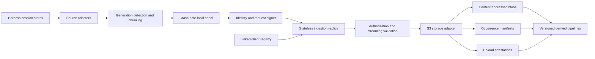

# Agent Archivist implementation plan

Status: decision-complete execution plan · Last updated: 2026-09-08

Revision: 2026-09-08 — locked DN-1 through DN-12 from the pre-flight review,
then clarified offline enumeration, backup evidence, SDK-hook scope, exact-coverage
reconciliation, and derived-use governance during bead-graph verification; the
former decision queue now points to the binding sections.

This plan turns the [research findings](../research/transcript-archiving-findings.md)
and [system requirements](../notes/requirements.md) into an implementation and
release sequence. It is deliberately more concrete than the research document.
When this plan and the normative requirements disagree, the requirements win until
an explicit requirements change is reviewed and committed.

## 1. Outcome — north star and mission

Build and publish a production-capable system that:

1. discovers durable coding-agent sessions on linked clients;
2. incrementally captures active and historical sessions without losing provenance;
3. authenticates every uploader and validates every submitted artifact;
4. stores content-addressed blobs, source occurrences, and upload attestations in
   S3-compatible storage;
5. converges safely after retries without server-local durable state;
6. supports ARMOR backed by B2 without making either one mandatory;
7. reports measurable archive coverage without logging transcript content;
8. exposes a versioned raw corpus for separately governed reflection, evaluation,
   retrieval, and dataset pipelines; and
9. reports semantic harness coverage separately from exact provider-exchange
   coverage so no uninstrumented inference is silently treated as archived.

The first production-ready release is complete only when the baseline acceptance
criteria in the requirements document pass against a reference S3 implementation
plus the direct B2 and ARMOR-backed B2 profiles, and Phase 9 exact-capture gates pass
for every route claimed as instrumented.

## 2. Scope boundaries

### In scope for the first production-ready release

- A portable host client with durable cursor and spool state.
- First-party adapters for Claude Code, Codex, OpenCode, and Pi.
- A versioned ingest protocol and machine-readable schemas.
- Proof-of-possession authentication for linked clients.
- A stateless, horizontally scalable ingestion server.
- A portable S3 storage adapter and explicit backend capability reporting.
- Deterministic logical deduplication of blobs, occurrences, and retry attestations.
- Docker, local Compose, Helm, and Linux service packaging.
- Content-free status, metrics, structured errors, and health endpoints.
- Synthetic conformance, integration, fault-injection, and compatibility tests.
- Exact request/response capture for traffic explicitly routed through the
  Archivist proxy or a supported SDK hook, with explicit `unobserved` coverage for
  traffic that bypasses those integrations.
- A migration path from deployment-specific collectors without importing their Git
  history or configuration into this repository.

### Sequenced after raw archive reliability

- Automatic semantic summarization or memory injection.
- Training or fine-tuning pipelines.
- A hosted multi-tenant control-plane UI.
- Full-text search, embeddings, knowledge graphs, and episode generation.
- Automated deletion of shared blobs without a proven mark-and-sweep design.
- Guaranteed physical exactly-once writes on storage without atomic conditional
  create.

### Non-goals

- **Replacing the agent harness's session UX.** Archivist is a collector, not a
  conversation client. Reopen only if a capture gap cannot be exposed through an
  adapter or provider hook.
- **Treating orchestrator logs as a substitute for harness transcripts.** They are
  correlated provenance, because their transformed output cannot prove semantic
  completeness.
- **Giving clients general-purpose S3 credentials.** Server-derived keys and scoped
  ingestion authorization are the security boundary; direct access would bypass it.
- **Copying complete harness databases or credential stores.** Database adapters use
  explicit projections because whole stores contain unrelated and secret state.
- **Making raw transcripts safe to prompt from merely because they are archived.**
  Only the governed derived pipeline may produce agent-consumable data.
- **A universal transparent provider proxy.** Version 1.0 captures only explicitly
  routed or hooked traffic and labels everything else unobserved. Reopen if supported
  harnesses expose a portable lossless interception API.
- **Requiring Kubernetes, ARMOR, B2, or one cloud provider.** Those are deployment
  profiles behind the public protocol and S3 contract.

### Glossary

- **Artifact:** one adapter-defined source stream, sidecar, database projection, or
  inference event stream belonging to a logical session.
- **Blob:** immutable canonical payload bytes stored once per tenant and raw digest.
- **Occurrence:** immutable provenance saying that one blob appeared at a specific
  artifact generation and byte/event range, independent of who uploaded it.
- **Upload attestation:** immutable provenance binding an occurrence and frozen
  request to its linked uploader; retries by that uploader converge, while a
  distinct authorized uploader remains separately auditable.
- **Generation:** a UUIDv7 epoch created when a source artifact is first observed or
  detected as replaced, truncated, or incompatibly rewritten.
- **Origin client:** the linked installation on which the source session arose.
- **Uploader client:** the linked installation sending the request; normally the
  origin, but potentially an explicitly delegated relay.
- **Linked client:** a client ID and public key authorized by a tenant authority
  record.
- **Canonical bytes:** exact file slices for file adapters and RFC 8785 JSONL records
  for projected database artifacts.
- **Semantic coverage:** capture of the harness-native session representation.
- **Exact inference coverage:** capture of provider request/response boundaries seen
  by an explicit proxy or SDK hook; it never implies observation of bypass traffic.

### Baseline acceptance scenarios

1. **Fresh active session:** a linked client discovers a newly appended complete
   record, durably spools it, uploads it through either of two replicas, receives a
   verifiable receipt, advances its cursor, and reports freshness within two
   collection intervals.
2. **Lost response and concurrent duplicate:** two retries of the same immutable
   occurrence race after the first receipt is lost; both converge to one logical
   blob, occurrence, and request/uploader attestation, return compatible receipts,
   and never require shared server state.
3. **Same bytes, distinct provenance:** two origin-client/session pairs submit the
   same canonical bytes; storage contains one tenant-scoped blob and two occurrences
   whose origins remain independently reconstructable.
4. **Marathon outage recovery:** storage is unavailable while a multi-gigabyte
   active session grows; the client respects its spool and free-disk limits, keeps
   the gap visible, then restores freshness reservations and largest-first backfill
   after service returns without skipping a complete record.
5. **Exact versus semantic coverage:** a session transcript is captured while one
   provider exchange traverses the supported proxy and another bypasses it; the
   report shows semantic coverage, one exact observed attempt, and one unobserved
   exact gap without merging the two claims.

**Decision:** Version 1.0 includes both semantic harness capture and exact capture
for supported instrumented provider paths, reported as separate coverage
dimensions. **Because:** semantic transcripts alone do not preserve every provider
attempt, while claiming universal exactness would hide bypass traffic. **Rejected:**
calling semantic-only capture complete; blocking the raw archive on a universal
proxy. **Enforced by:** scenario 5, Phase 9 conformance tests, the compatibility
matrix, and independent status fields. **Revisit if:** every supported harness gains
a portable, lossless provider-event API; it must still expose observation gaps.

## 3. Decisions already fixed

The following decisions are architectural constraints, not phase-level options:

- The ingestion data plane is stateless between requests.
- S3-compatible object storage is the durable source of truth.
- Clients own discovery cursors, pending spools, retry schedules, and acknowledgements.
- A client installation has a persistent cryptographic identity; hostname is only
  mutable provenance.
- Logical session identity is tenant + origin client + harness + upstream session.
- Blob identity and occurrence identity are separate.
- Source occurrence and upload-attestation identity are separate, so relay
  provenance cannot overwrite or multiply the source occurrence.
- Raw blobs are addressed by SHA-256 of canonical uncompressed payload bytes.
- Object keys are tenant-scoped and derived by the server.
- Retries reuse byte-identical envelopes and deterministic identities.
- Largest histories receive backfill priority, with freshness and fairness quotas.
- Raw, catalog, and derived namespaces remain separate and versioned.
- Operational telemetry never includes transcript bodies or authentication material.
- The public project uses only synthetic fixtures and independent Git history.
- The public project is licensed under Apache License 2.0; every distributed source
  and binary artifact carries the required license and notice material.
- Version 1.0 reports semantic and exact-inference coverage independently; exact
  capture is supported only for explicitly instrumented traffic.

Changing one of these decisions requires updating the research, requirements, and
this plan together.

## 4. Implementation baseline and tech stack rationale

The implementation is a Rust 1.97.1 workspace using edition 2024, pinned in
`rust-toolchain.toml`, with the root `Cargo.lock` committed. Rust provides portable
single binaries for host installation, bounded-memory streaming, shared protocol
types between client and server, and strong testability for state transitions.

Components:

- Tokio for asynchronous I/O and cancellation.
- Axum and Tower for the HTTP server and middleware.
- Serde for protocol types and canonical manifest serialization.
- AWS SDK for Rust behind a narrow internal S3 trait.
- SQLite in WAL mode for client state only.
- Clap for the command-line interface.
- Tracing and OpenTelemetry-compatible exporters with content-safe fields.
- Ed25519 client and receipt-signing keys.

Tech stack decision rationale:

**Because:** one Rust workspace shares protocol types across a low-footprint host
daemon and streaming server, and the required toolchain exists in the build
environment. **Rejected:** Python, because runtime variability weakens single-binary
distribution; Go, because it offers no requirement-level advantage worth splitting
the selected Rust type and state-machine implementation. **Enforced by:** the pinned
toolchain and edition, `cargo fmt --check`, Clippy with warnings denied, and full
workspace tests on the same commit. **Revisit if:** a required supported platform
cannot run the binary or the selected S3/TLS stack cannot pass compatibility tests.

No pre-1.0 release promises an older minimum supported Rust version. Every release
records its exact toolchain; toolchain bumps are reviewed changes with the full
conformance and compatibility suite.

Library selection is not an excuse to expose SDK types across crate boundaries.
Protocol, storage, adapter, and state-machine interfaces must remain owned by this
project so an implementation can be replaced without changing the wire contract.

## 5. Architecture overview



### Client data flow

1. Discover configured accounts and source roots through adapters.
2. Inventory outstanding bytes or events without copying transcript content into
   logs or status.
3. Detect source generation and select complete record boundaries.
4. Materialize an immutable canonical chunk in a mode-restricted spool.
5. Calculate the canonical uncompressed digest, deterministic occurrence ID, and
   deterministic request/uploader attestation ID.
6. Freeze the canonical upload envelope. Retries never regenerate its timestamps or
   IDs; each attempt adds fresh, short-lived request authorization outside it.
7. Upload according to the freshness/backfill scheduler and error policy.
8. Validate the authenticated receipt and atomically advance local acknowledgement
   state.
9. Remove the acknowledged spool object only after the state transaction commits.

### Server data flow

1. Bound request headers, the 64 KiB envelope, body size, 15-minute duration, and
   16-request process concurrency before allocating payload-scale resources.
2. Authenticate the uploader and load its tenant-signed linked-client authorization
   record from S3 or the unexpired 60-second in-memory cache.
3. Verify the per-attempt signature, tenant, origin delegation, timestamp, and
   five-minute replay window.
4. Validate schema, identifiers, source coordinates, encoding, and declared digest.
5. Stream-decompress and hash the body while writing uncommitted multipart data.
6. Abort the write if size, expansion ratio, media, or digest validation fails.
7. Commit the blob using the backend's strongest supported idempotency primitive.
8. Write the deterministic occurrence manifest after the blob is durable.
9. Write the deterministic upload attestation after the occurrence is durable.
10. Return an authenticated receipt describing only the guarantee actually achieved.

If the process exits after any commit but before the attestation or receipt, an
identical retry checks or rewrites the same deterministic objects and completes the
same attestation. No server-side recovery queue is required.

### Control-plane boundary

Linking and revocation are control-plane operations. Each client owns an Ed25519 key.
The initial administrator CLI writes tenant-authority-signed client, key, scope,
delegation, rotation, revocation, and receipt-verification-key records to a dedicated
S3 prefix. Ingestion
replicas are configured with tenant authority public keys and two independently
scoped storage identities, even when both use the same endpoint and bucket: a
control reader that cannot write any object, and a raw writer that can create,
multipart-write, and abort only the tenant raw prefix but cannot read or delete
objects or access control/catalog/derived prefixes. Backup and restore use a third
offline identity. This split maps to separate B2 application keys when one
credential cannot express disjoint action-by-prefix policy; an optional raw reader
is a fourth identity and is never required by the portable ingest path.

Administrative control mutation uses a separate offline `ControlAdminStore` and
credential that can put only validated, tenant-authority-signed objects below the
tenant control prefix; it cannot read or write raw, catalog, derived, tombstone, or
legal-hold data. The public trait accepts complete immutable control records and a
small set of signed current-pointer records, never arbitrary keys or payload bytes.
The S3 adapter derives each key from the validated record type, rejects overwrite of
an incompatible immutable record, and permits a current-pointer replacement only
when its signed epoch increases. Ingest replicas never receive this credential.

Request authorization is fresh per upload attempt and valid for five minutes with at
most five minutes of clock skew. Replays inside that window are harmless because the
operation is logically idempotent. Trust records cache for at most 60 seconds. If S3
is unavailable, an unexpired record may be used; otherwise the server fails closed
with retryable 503. Revocation therefore has a maximum 60-second propagation delay.
Key rotation accepts old and new keys for 24 hours, and retries authorize the frozen
envelope with the current key. Relay authority is the conjunction of tenant, origin,
harness, and operation scopes, never their union.

**Because:** tenant-signed records retain a stateless data plane without letting a
compromised raw-data credential authorize itself. **Rejected:** bearer tokens, which
are replayable and weakly host-bound; mTLS-only identity, which adds public-client and
relay complexity; indefinitely stale cache entries, which defeat revocation.
**Enforced by:** altered, stale, cross-tenant, revoked, registry-outage, delegation,
and rotation-with-pending-spool tests. **Revisit if:** an external identity provider
can preserve the same offline verification and origin/uploader delegation semantics.

A later web or OIDC linking service may replace the administrator CLI without
changing client identity or the ingestion protocol.

## 6. Planned repository structure

```text
agent-archivist/
├── Cargo.toml
├── Cargo.lock
├── rust-toolchain.toml
├── containers/
│   └── agent-archivist/
│       ├── Dockerfile
│       └── VERSION
├── crates/
│   ├── archivist-protocol/       # wire types, validation, IDs, key derivation
│   ├── archivist-storage/        # storage trait and capability model
│   ├── archivist-storage-s3/     # portable S3 implementation
│   ├── archivist-auth/           # signing, verification, linked-client records
│   ├── archivist-client-core/    # cursor, spool, scheduler, upload state machine
│   ├── archivist-adapter-sdk/    # discovery and immutable artifact interfaces
│   ├── archivist-adapter-claude/
│   ├── archivist-adapter-codex/
│   ├── archivist-adapter-opencode/
│   ├── archivist-adapter-pi/
│   ├── archivist-server/         # stateless HTTP data plane
│   └── archivist-cli/            # collect, serve, link, admin, status commands
├── schemas/
│   └── v1/                       # checked-in JSON schemas and examples
├── fixtures/
│   └── synthetic/                # generated, non-sensitive conformance corpus
├── tests/
│   ├── conformance/
│   ├── compatibility/
│   ├── fault-injection/
│   └── end-to-end/
├── deploy/
│   ├── compose/
│   ├── helm/
│   └── systemd/
├── docs/
│   ├── notes/
│   ├── plan/
│   ├── protocol/
│   ├── research/
│   ├── security/
│   └── operations/
└── tools/                         # fixture generation and compatibility runners
```

The crate boundaries above are fixed through the first vertical slice. Adapter crates
remain separate so harness-specific dependencies and schema churn do not leak into
the server or protocol core. A later consolidation requires benchmark or dependency-
cycle evidence and updates this tree in the same commit; workers do not collapse
boundaries ad hoc.

## 7. Contract design

### 7.1 Version axes

Version these dimensions independently:

| Dimension | Initial form | Compatibility rule |
|---|---|---|
| HTTP route | `/v1/ingest` | Breaking wire changes use a new route major |
| Envelope schema | `envelope_version` | Unknown major fails closed |
| Occurrence schema | `occurrence_version` | Readers retain old-version support |
| Upload-attestation schema | `attestation_version` | Readers retain old-version support |
| Storage layout | `v1` key prefix | Never silently repurpose an existing prefix |
| Adapter projection | adapter + projection version | Preserve the version in provenance |
| Derived pipeline | pipeline name + version | Rebuildable; never overwrites raw data |

Software packages use semantic versioning, but package version is not a substitute
for any data-format version. Within a `v1` schema, new optional fields are additive
and old readers ignore their semantics while retaining them inside signed bytes.
New required fields, redefined fields, or changed identity rules require `v2`.
Unknown major versions and unknown security- or identity-bearing enum values fail
closed. Protocol structures contain no floating-point values. These compatibility
rules are enforced by old-reader/new-writer and new-reader/old-writer fixtures.

### 7.2 Wire request and authentication

`POST /v1/ingest` accepts exactly one occurrence as `multipart/related`. Part one is
`application/vnd.agent-archivist.envelope+json;version=1`; part two is the payload
representation declared in the envelope. The canonical envelope is RFC 8785 JSON,
contains no floats, and is limited to 64 KiB. The payload part streams and is never
base64-embedded in JSON.

Each attempt uses an Ed25519 HTTP message signature covering the HTTP method, route,
content type, whole-request content digest, canonical envelope digest, payload
digests, uploader key ID, authorization epoch, and fresh authorization timestamp.
The server may pre-authorize the key ID before receiving the body, but does not
commit storage until it verifies the complete signature and payload. The immutable
envelope does not contain the per-attempt signature or authorization timestamp, so a
retry outside the five-minute window receives fresh authorization without changing
occurrence or attestation identity.

**Because:** multipart provides a bounded metadata part followed by a streaming body,
and canonical JSON keeps independent implementations interoperable. **Rejected:**
metadata in HTTP headers, whose size limits vary; a custom binary frame, which raises
the community implementation cost; byte-identical authorization on every retry,
which necessarily expires. **Enforced by:** language-neutral golden requests, a
standalone signature verifier, reordered/whitespace JSON cases, altered multipart
cases, and retry-after-window tests. **Revisit if:** either reference HTTP stack
cannot stream multipart without payload-scale buffering.

### 7.3 Envelope fields

The version 1 envelope defines:

- protocol and envelope versions;
- tenant, origin client, and uploader client IDs;
- harness, upstream session ID, artifact kind, and adapter projection version;
- artifact identity, source generation, byte/event range, and ordering fields;
- canonical uncompressed SHA-256, incoming representation checksum, storage profile,
  and transport encoding;
- compressed and uncompressed sizes;
- UTC source, capture, and envelope creation timestamps;
- deterministic occurrence and upload-attestation IDs and UUIDv7 request ID;
- optional parent session, orchestrator attempt, trace, and inference request IDs.

The immutable spooled envelope excludes server commit time, the per-attempt
authorization epoch/key/timestamp, and the per-attempt signature. Durations and
retry budgets use a monotonic clock; persisted timestamps use RFC 3339 UTC; local
time is a display choice only.

### 7.4 Identifier and collision rules

Tenant IDs are issuer-created UUIDv4 values. Client IDs are installation-generated
UUIDv4 values. Generation and request IDs are UUIDv7 values frozen when the spool
entry is created. UUIDs use lowercase canonical text. Harness IDs match
`[a-z0-9][a-z0-9._-]{0,63}`. Upstream session and adapter artifact IDs are opaque
UTF-8 strings of at most 1,024 bytes; they are neither case-folded nor Unicode-
normalized.

All derived hashes use SHA-256 over a domain label followed by zero-delimited,
length-prefixed fields:

```text
session_hash    = H("session-v1", tenant, origin_client, harness, upstream_session)
artifact_hash   = H("artifact-v1", session_hash, artifact_kind, adapter_id,
                    adapter_projection_version, adapter_artifact_id)
blob_digest     = SHA256(canonical_uncompressed_bytes)
occurrence_id   = H("occurrence-v1", session_hash, artifact_hash, generation,
                    range_kind, range_start, range_end, blob_digest)
attestation_id  = H("attestation-v1", occurrence_id, uploader_client, request_id)
```

Hostname is mutable provenance and never enters these identities. A missing harness
session ID is replaced by an adapter-minted UUIDv4 with `id_source=synthetic` in the
manifest; it is never inferred from a path name. An existing object key with different
canonical content or incompatible identity metadata, when found by read-capable
ingest or audit, produces `integrity_conflict`; before a receipt that is HTTP 409,
and after a receipt it blocks the source/prefix and requires operator action.

**Because:** length-prefixed opaque bytes prevent delimiter, path, case, and Unicode
ambiguity; origin-client scope contains cloned harness UUIDs; and a separate
request/uploader attestation preserves relay audit history without changing the
source occurrence. **Rejected:** raw `host-session` paths, because hostnames mutate
and IDs may be unsafe path components; embedding uploader/request fields in the
occurrence, because concurrent authorized uploaders would produce different bytes at
one deterministic key; random occurrence or attestation IDs, because lost-response
retries could not reproduce them.
**Enforced by:** golden ID/key vectors, arbitrary-Unicode properties, cross-tenant
tests, synthetic-ID tests, concurrent relay/origin tests, and incompatible-existing-
object tests. **Revisit if:** a physical installation must migrate between tenants;
that requires an explicit signed alias record, not different hash rules.

### 7.5 Object keys

Version 1 uses server-produced `zstd-v1` storage objects:

```text
tenants/<tenant>/v1/raw/blobs/zstd-v1/sha256/<digest-prefix>/<digest>.zst
tenants/<tenant>/v1/raw/occurrences/<origin>/<harness>/<session-shard>/<session-hash>/<occurrence>.json
tenants/<tenant>/v1/raw/attestations/<occurrence-prefix>/<occurrence>/<attestation>.json
tenants/<tenant>/v1/control/clients/<client>.json
tenants/<tenant>/v1/control/revocations/<client>/<epoch>.json
tenants/<tenant>/v1/control/receipt-keys/<key>.json
tenants/<tenant>/v1/catalog/checkpoints/<checkpoint>.json
tenants/<tenant>/v1/derived/<pipeline>/<version>/<partition>/<object>
```

Raw upstream session IDs are hashed in object keys for safety and privacy. The
encrypted/restricted occurrence manifest retains the original identifier and only
source-stable provenance. The attestation contains the occurrence ID, origin,
uploader, request ID, adapter capture/envelope times, and delegation relation; it
does not duplicate transcript content. All key segments are validated opaque IDs or
hashes; source paths and hostnames never become unsanitized key components. A new
canonical storage encoder requires a new named profile and prefix; it never rewrites
the meaning of `zstd-v1`.

The canonical occurrence fields are schema version, tenant, session/artifact hashes,
encrypted upstream identifier, harness, adapter/projection version, generation,
range/order coordinates, blob digest, storage profile, and a source-encoded event
time when one exists. Uploader, request ID, discovery/capture time, authorization,
and commit time are excluded. The canonical attestation fields are schema version,
tenant, occurrence ID, origin, uploader, frozen request ID, discovery/capture and
envelope times, and direct/relay relation. Per-attempt authorization and server
commit time exist only in the signed receipt.

### 7.6 Canonical payload, compression, chunking, and limits

File adapters preserve exact complete-record source slices as canonical bytes.
Database adapters emit one RFC 8785 JSON object plus LF per projected event, with a
versioned field allowlist. The client may transport those bytes raw or with a declared
transport encoding. The server decodes them, hashes the canonical bytes, and produces
the stored representation using the pinned `zstd-v1` encoder: Zstandard level 3,
single-threaded, no dictionary, content size and checksum enabled. The exact encoder
dependency is pinned for the lifetime of the profile.

Defaults and hard caps are:

| Limit | Version 1 value |
|---|---:|
| Target canonical chunk | 16 MiB |
| Single structured record | 256 MiB maximum |
| Envelope | 64 KiB maximum |
| Expansion ratio | 100:1 maximum |
| Request duration | 15 minutes maximum |
| Multipart part | 8 MiB |
| In-flight uploads | 16 per server process |
| In-flight uploads per client | 4 per server process |
| New request rate | 60/minute/client/replica, burst 8 |

Adapters chunk on complete JSONL records, database events/messages, immutable source
objects, or provider event boundaries. They never split a structured record to meet
the target. A record over 256 MiB is quarantined as `record_too_large`, reported as a
coverage gap, and never silently truncated. Server limits may be lowered by policy;
raising a hard cap requires the resource/fuzz suite on the same commit.

**Because:** the corpus is large enough that compression materially affects cost,
while a server-owned, versioned encoder keeps stored bytes consistent across clients.
**Rejected:** client-specific gzip/zstd output under one key, which changes with
implementations; uncompressed storage, which imposes permanent avoidable cost;
record splitting, which destroys source fidelity. **Enforced by:** cross-platform
golden blobs, decompression fuzzing, limit-boundary tests, and an RSS ceiling of
512 MiB at the default 16-request concurrency on the reference four-vCPU test runner.
**Revisit if:** the encoder has a correctness/security defect, median compression is
below 1.2:1, or sustained reference-runner throughput is below 50 MiB/s; a replacement
uses a new storage profile.

### 7.7 S3 commit and concurrency contract

The production deployment's S3 profile requires multipart
create/upload/complete/abort plus `PUT`, `HEAD`, and `GET`; the ingestion identity
itself requires only `PUT` and multipart operations. Offline verify/restore uses
`HEAD`/`GET`, offline catalog and governance additionally require paginated
`ListObjectsV2`, and an optional read identity enables the ingest preflight
optimization.
MinIO is the local reference implementation. Conditional create, native stored
checksums, versioning, and server-side encryption are reported capabilities;
conditional create is not required because the target B2 profile does not provide
the needed portable guarantee.

The server derives every target key, streams canonical bytes through the `zstd-v1`
encoder into an uncommitted multipart upload, and completes only after all sizes,
digests, and the request signature verify. It then commits the canonical occurrence
and request/uploader attestation in that order. The occurrence bytes contain only
source-stable fields; request, uploader, and capture-time fields live in the
attestation, preventing a relay from overwriting source provenance. When a compatible
blob already exists, the server still drains and verifies the submitted payload.
Use atomic create-if-absent when supported; otherwise equivalent deterministic
overwrite is logically idempotent and may create a noncurrent physical version under
concurrency. A preflight `HEAD` is an optional optimization only for deployments
that deliberately grant raw-read permission; the baseline writer does not require
it and never treats it as the correctness guard.

The storage capability model is:

```text
conditional_create: supported | unavailable
multipart_commit_abort: required
stored_checksum: sha256 | md5 | provider_specific | unavailable
versioning: enabled | disabled | unknown
server_side_encryption: verified | unavailable
```

`AuditRestoreStore` enumeration freezes an immutable `inventory-v1` before a
rebuild, restore sample, or reference scan. Its paginator follows continuation
tokens to exhaustion, rejects duplicate and out-of-prefix keys, records key, size,
ETag, storage version when exposed, and observation time, then sorts by opaque key
bytes before hashing the inventory. Consumers never assume that a portable S3 list
is a transactionally consistent snapshot: a page error, repeated token, mutation
detected while freezing the inventory, or conflicting version observation fails the
operation closed. Catalog rebuild consumes one frozen inventory. Each garbage-
collection pass freezes a separate complete inventory at least 24 hours apart and
revalidates every candidate with `HEAD` immediately before deletion; any changed or
unreadable candidate survives the pass. Compatibility tests inject page mutation,
duplicate pages, token loops, and concurrent writes on every backend profile.

**Because:** S3 is the durable source of truth, so deterministic rebuild and safe
collection need an explicit exhaustive enumeration contract rather than an implied
database index. **Rejected:** relying on one live list traversal as a snapshot;
making `ListObjectsV2` available to ingestion; provider inventory as the only
portable input. Provider-generated inventories may be imported only after they
validate into the same `inventory-v1`. **Enforced by:** frozen-inventory digests,
pagination fault tests, rebuild reproducibility, two-pass collection, and
pre-delete revalidation. **Revisit if:** every supported backend exposes a stronger
portable snapshot primitive; it must still materialize auditable inventory evidence.

Receipts report a result for the blob, occurrence, and attestation, each exactly one
of `created`, `already_present`, `replaced_equivalent`, or
`logically_committed_unknown_physical_result`. Existing incompatible metadata or
content detected by a read-capable profile or audit is an integrity conflict, never
a duplicate; conditional existence without readable compatible metadata is not
reported as `already_present`. A writer-only overwrite profile reports only the
weaker physical result and relies on deterministic canonical bytes plus audit and
restore scans. The base service adds no database or distributed lock. Its separate
identities permit raw-
prefix write and control-prefix read only; optional raw read, body restore, and
deletion belong to separate explicitly configured identities.

**Because:** validate-before-complete prevents false content addresses while retaining
replaceable replicas. **Rejected:** `HEAD` then `PUT` as exactly-once, because replicas
race; random staging keys plus a recovery queue, because that creates durable server
state; mandatory conditional create, because it excludes B2. **Enforced by:**
concurrent MinIO/B2/ARMOR tests, commit-boundary termination, incompatible-object and
IAM-policy tests, physical-version reporting, and 24-hour orphaned-multipart cleanup.
**Revisit if:** B2 gains verified atomic conditional creation or a future storage
profile elects to require it.

### 7.8 Receipts, errors, retries, and poison artifacts

Receipts are RFC 8785 JSON signed by a tenant-scoped server Ed25519 key. The tenant
authority signs the corresponding verification-key record; the client pins the
tenant authority root during linking, and each receipt carries the signer key ID and
certificate record so an offline client can verify a rotation without trusting the
server transport. Receipt keys rotate every 30 days with seven days of old/new
signing overlap; old public records remain readable indefinitely for retained
receipts. Private keys enter the server only through secret references. Receipts bind
the tenant, request, occurrence, upload attestation, blob, server-derived object
keys, per-object storage outcomes, successful authorization key/epoch, and UTC
commit time. The client acknowledges only after verifying the authority chain,
receipt signature, and every identity field.

Every error body contains version, stable code, retryable boolean, content-safe
message, and request ID. The behavior is fixed by class:

| Condition | HTTP | Client action |
|---|---:|---|
| Invalid envelope/media | 400/415 | Quarantine artifact; continue other sources |
| Unlinked/revoked/unauthorized | 401/403 | Pause uploads; require link/rotation action |
| Integrity conflict | 409 | Stop affected tenant/source; page operator |
| Oversized but splittable | 413 | Rechunk at record boundary and retry |
| Oversized unsplittable record | 413 | Quarantine and report coverage gap |
| Timeout/rate limit/too early | 408/425/429 | Retry |
| Registry/storage/transient server failure | 5xx | Retry; no receipt |
| Network failure or lost response | none | Retry identical envelope with fresh auth |

Retryable failures use full jitter starting at one second, doubling to a 15-minute
cap, and continue while the spool entry is retained. Success resets the backoff.
There is no arbitrary attempt limit. Any blob-only or blob-plus-occurrence partial
commit returns 503 without a receipt; the next attempt repairs the same occurrence
and attestation. Metrics record bounded error codes, never messages derived from
source content.

**Because:** poison input must not block the entire historical queue, integrity
failures must not become overwrite loops, and the client needs durable acceptance
evidence independent of the current TLS endpoint. **Rejected:** a fixed retry count,
because outages outlive arbitrary counts; retrying every non-2xx, because malformed
history would storm the service; TLS-only or unsigned receipts, because they cannot
survive endpoint or replica replacement as evidence. **Enforced by:** the
error/action matrix, poison-continuation, lost-receipt, partial-commit, authority-
chain, receipt-key-rotation, and receipt-signature tests. **Revisit if:** a tenant
requires a maximum retry age; expiration then becomes an explicit retention policy.

### 7.9 Client state, configuration, and scheduling

One mutating process owns a client state directory, enforced by an OS advisory lock.
A second mutator exits 75 with a versioned JSON error. `status` opens a read-only
SQLite snapshot. State and configuration use platform-native directories (XDG on
Linux) and TOML. Precedence is non-secret CLI flags, non-secret environment, config
file, then defaults. Secret values are accepted only by protected file/key-store
reference, never literal CLI arguments.

The state directory is mode 700 and spool objects are mode 600. A spool bundle is
written, synchronized, and atomically renamed before its SQLite row commits. Startup
reconciles complete unindexed bundles and removes acknowledged bundles left after a
crash. Receipt storage, cursor advance, and acknowledgement occur in one SQLite
transaction; payload cleanup happens only after commit. SQLite uses WAL mode and
explicit migrations.

The daemon runs an internal 15-minute loop with up to 10% jitter and never overlaps
itself. Each cycle drains the existing spool, gives one chunk to every active source,
then spends remaining capacity largest-backlog-first with a 256 MiB per-source
quantum. Default spool cap is 2 GiB with a 5 GiB filesystem-free floor. At either
high-water condition, the client stops materializing new payloads, continues retrying
existing entries, and reports degraded status; it resumes below 80% of the cap and
above the free-space floor.

**Because:** SQLite does not make filesystem scans and cleanup safe for multiple
writers, and an unbounded archive backlog must not disrupt the coding host.
**Rejected:** concurrent mutators relying only on SQLite locks; external cron as the
only scheduler, because overlap and portability vary. **Enforced by:** second-writer,
crash-transition, orphan reconciliation, disk-pressure, jitter, non-overlap, and
bounded-starvation tests. **Revisit if:** pilot evidence shows 2 GiB cannot keep one
cycle fresh or supported hosts routinely cannot meet the free-space floor.

### 7.10 Retention, backup, rebuild, and deletion

Raw occurrences, upload attestations, and blobs default to indefinite retention, and
the ingestion API has no delete route. A production deployment does not reduce source
retention until it has daily S3 inventory, either an independent second-failure-
domain copy or protected version history, and a successful quarterly sampled
restore. Catalogs and derived indexes rebuild with
`archivist catalog rebuild --from-occurrences` using only raw S3 occurrences,
attestations, and blobs.

Release qualification uses the reference `inventory-copy-v1` backup profile: freeze
and sign a daily `inventory-v1`, copy every referenced raw and control object through
an offline identity to an independently credentialed destination, record source and
destination size, digest, ETag, and version identifiers when available, then verify
a deterministic byte sample from the destination. Two distinct local S3 instances
are sufficient only for the synthetic Compose demonstration; B2 and ARMOR deployment
evidence names a destination in a separate administrative or storage failure domain.
A deployment may instead meet its production precondition with protected version
history, but it must freeze the same signed inventory evidence, prove recovery of a
prior version after synthetic overwrite and deletion, and document the correlated-
failure risk. Unknown version state never passes. The verification manifest records
the selected profile, inventory digest, destination class, restored sample, and
result without object paths or identifiers.

Deletion is an offline administrator workflow: write an occurrence tombstone, honor
legal holds, wait 30 days, complete two full-reference scans at least 24 hours apart,
and only then delete a blob with no retained occurrence. Garbage collection is
disabled by default. Legacy archives remain read-only for at least 90 days after
cutover and until one post-cutover restore drill passes, whichever is later.

**Because:** shared blobs make ordinary delete operations unsafe, and storage
durability is not proof of recovery. **Rejected:** mutable reference counts in the
ingest path, because they add global state; raw-blob lifecycle expiry, because it
cannot see occurrence references. **Enforced by:** deterministic rebuild, two-pass
GC simulation, legal-hold, retained-reference, and quarterly restore-drill evidence.
**Revisit if:** tenant policy or law requires shorter default retention; that policy
must be explicit during linking and still use tombstones and reference-safe GC.

### 7.11 Edge-case catalog and failure modes

| ID | Condition | Required behavior and recovery |
|---|---|---|
| `EC-01` | File ends with a partial record | Keep the tail local; do not spool or advance beyond the last complete boundary. |
| `EC-02` | File truncates, is replaced, or its acknowledged tail changes | Close the old generation, create a UUIDv7 generation, and preserve both histories. |
| `EC-03` | Two clients report the same harness/session UUID | Derive distinct tenant/origin-scoped session identities; never merge on the upstream UUID alone. |
| `EC-04` | The same request is retried or races on two replicas | Drain and validate both requests, converge to one logical occurrence and upload attestation, and return compatible signed receipts. |
| `EC-05` | Different occurrences contain identical canonical bytes | Store one tenant blob and every distinct provenance manifest. |
| `EC-05A` | Origin and relay independently upload the same source occurrence | Keep one occurrence plus one attestation per frozen uploader/request; never let uploader fields overwrite the occurrence. |
| `EC-06` | A read-capable ingest check or audit finds incompatible digest, size, profile, or identity metadata at a deterministic key | Before receipt return `409 integrity_conflict`; at any time page content-free and block that source/prefix until investigated. |
| `EC-07` | A complete record exceeds 256 MiB or the expansion ratio exceeds 100:1 | Abort before commit, quarantine locally with a bounded reason, and report a coverage gap. |
| `EC-08` | A database/source fingerprint is unknown | Read no projected content; report `unsupported` and require an adapter/fixture update. |
| `EC-09` | Trust registry becomes unavailable | Use a valid cached record for at most 60 seconds; then remove readiness and return retryable `503` without storage writes. |
| `EC-10` | Blob or occurrence commits but attestation/receipt delivery fails | Return no success before all three objects; retry the immutable envelope with fresh authorization until a receipt is durable locally. |
| `EC-11` | Client reaches 2 GiB spool or falls below 5 GiB free space | Stop adding spool data, retain cursors before the uncaptured range, drain pending work, and expose degraded status. |
| `EC-12` | Client is revoked with pending spool entries | Preserve the spool, pause uploads on `401`/`403`, and resume only after an operator links a valid epoch/key. |
| `EC-13` | Provider traffic bypasses proxy/SDK instrumentation | Preserve semantic capture and report exact coverage as `unobserved`; do not infer request/response completeness. |

Failure recovery never changes the logical meaning of an accepted raw occurrence or
attestation, advances a cursor without a verified receipt, or converts a
content/identity conflict into a retry loop. The client owns offline/degraded
recovery; the server owns request-bounded cleanup; S3
holds the only durable server-side truth.

Anti-patterns prohibited by the design are: hostname-only session keys, client-
chosen S3 paths, direct client S3 credentials, mutable envelopes that include retry
authorization, `HEAD`-then-`PUT` claims of physical exactly-once storage, whole
harness-database upload, permissive parsing of unknown source schemas, content in
telemetry, ingest-time reference counts, automatic raw-blob lifecycle expiry, and
making the derived catalog a prerequisite for ingestion.

## 8. Delivery phases and completion criteria

Each phase ends with a committed artifact and an objective exit gate. Exploratory
code that precedes a dependency gate stays in a repository-external scratch
directory and is not merged. Phase code consumes the last gated contract, and a
phase is complete only when its dependencies and its own gate pass in the same
commit being evaluated.

### Phase 0 — Project foundation and decision framework

Deliverables:

- Create the Rust workspace and crate skeletons without placeholder production
  behavior.
- Add `CONTRIBUTING.md`, `SECURITY.md`, support policy, code of conduct, and release
  process.
- Pin Rust 1.97.1 in `rust-toolchain.toml`, commit `Cargo.lock`, and add formatting,
  Clippy, unit-test, documentation, dependency-audit, license, and secret-scanning
  checks.
- Add the requirement-to-test traceability format. A locked decision changes only
  when its stated revisit trigger fires; that change updates this plan, schemas,
  fixtures, compatibility notes, and tests in the same commit instead of creating
  a second source of truth in an ADR directory.
- Add a deterministic synthetic fixture generator; do not hand-copy real sessions.
- Establish conventional configuration, error-code, and metrics naming.
  Error-code naming is defined by `docs/notes/error-codes.md` and enforced by
  the registry gate in `tools/check-error-codes.py`; configuration naming is
  defined by `docs/notes/configuration.md` and enforced by the registry gate
  in `tools/check-config.py`, which also scans committed files for literal
  values assigned to secret-reference settings; metrics naming remains a
  separate Phase 0 deliverable.
- Document reproducible local development commands.
- Add `containers/agent-archivist/{Dockerfile,VERSION}`. The version file contains
  the SemVer image tag and changes in the same commit as a release.
- Add downstream GitOps work for an `agent-archivist-ci` Argo WorkflowTemplate: use
  the shared Rust verification template for commit checks and dedicated Forgejo
  checkout, cross-build, Docker Buildx, signing, and release steps for
  multi-architecture artifacts. Do not use the generic mutable-tag container
  workflow and do not add GitHub Actions; Forgejo is authoritative and GitHub
  remains a read-only repository mirror.

Exit gate:

- A clean checkout runs all baseline checks with no external credentials.
- Generated fixtures reproduce byte-for-byte from a recorded seed.
- Every planned crate has an owner/purpose statement and no circular dependency.
- A Forgejo `main` push runs the Argo verification path, and the release workflow
  fails before publishing an annotated tag of the form `vX.Y.Z` unless it matches
  `containers/agent-archivist/VERSION`.

**Decision:** Official CI runs through the downstream GitOps-managed Argo service;
official OCI artifacts are
`ronaldraygun/agent-archivist:X.Y.Z` for Linux `amd64` and `arm64`; release archives
and checksums are attached to the Forgejo `vX.Y.Z` release. Cosign signs the OCI
digest and a release manifest using a release key exposed by reference only to the
Argo release step; the committed public key verifies both. **Because:** this follows the
authoritative hosting and GitOps path while giving downstream users independently
verifiable artifacts. **Rejected:** GitHub Actions and client-side dual publishing;
unsigned artifacts; mutable or bare-SHA deployment tags. **Enforced by:** Argo
templates, tag/version consistency tests, signature verification in the release
smoke test, and semver-pinned GitOps manifests. **Revisit if:** the authoritative
forge or registry changes, or a supported transparency-log keyless signer is
available to the Argo service account; migration must preserve verification of old
releases.

### Phase 1 — Protocol, identity, and storage contracts

Implement the locked contracts in Sections 7.1 through 7.11 before production
data-path code. This phase translates those decisions into machine-readable schemas
and vectors; it does not choose alternate framing, identity, compression, storage,
trust, or acknowledgement semantics.

Deliverables:

- Versioned envelope, occurrence, upload-attestation, linked-client,
  receipt-verification-key, revocation, error, and receipt schemas.
- Normative protocol and storage-layout documents.
- Golden valid/invalid envelopes and deterministic ID/key vectors.
- A small language-neutral conformance corpus containing expected signatures,
  digests, and object keys.
- Versioned CLI/config reference and schemas defining command names, flags, TOML
  keys, defaults, precedence, stdout/stderr, exit codes, and secret-reference fields
  before client command implementation.
- A threat model covering spoofing, replay, cross-tenant writes, digest confusion,
  decompression bombs, poisoned manifests, and metadata leakage.
- Compatibility fixtures that prove an old reader accepts additive optional fields,
  rejects unknown security-relevant enum values, and rejects a required-field or
  semantic change that lacks a new major schema version.

Exit gate:

- The Rust implementation and a standalone verifier that does not import the
  protocol crate produce identical signatures, IDs, and keys.
- Every field has bounds, normalization rules, and a compatibility rule.
- The threat model has a mitigation or explicitly accepted risk for every finding.
- The normative documents, schemas, generated bindings, fixtures, and verifier are
  updated and pass together in one commit.

### Phase 2 — Storage core and backend compatibility

Deliverables:

- Define capability-aware `RawWriteStore`, `ControlReadStore`, offline
  `ControlAdminStore`, and offline `AuditRestoreStore` traits. Only the raw writer
  has begin/write/commit/abort semantics; only the control administrator can write
  derived control-record keys; the server cannot obtain administration,
  audit/delete, or raw-read methods through its ingest configuration.
- Implement the portable S3 adapter with endpoint, region, path-style, TLS, and
  encryption configuration.
- Require `PutObject`, `HeadObject`, `GetObject`, `CreateMultipartUpload`,
  `UploadPart`, `CompleteMultipartUpload`, and `AbortMultipartUpload`; treat
  conditional create, versioning, provider checksums, and lifecycle inspection as
  observed optional capabilities rather than portability requirements.
- Implement content-addressed blob commit plus deterministic occurrence-manifest and
  upload-attestation commits.
- Add capability probing that does not mutate arbitrary keys and caches only
  advisory results.
- Add synthetic compatibility tests for conditional create, concurrent writers,
  multipart abort, checksums, versioning, and equivalent overwrite.
- Test a local reference backend, B2, and the ARMOR S3 path.
- Configure the local MinIO reference profile with separate raw-write/control-read
  permissions and a 24-hour incomplete-multipart cleanup rule. Document equivalent
  B2 and ARMOR lifecycle recommendations, including noncurrent duplicate versions.

Exit gate:

- Repeated and concurrent writes converge to one logical blob, occurrence, and
  per-request/uploader attestation on every supported profile.
- Reports distinguish logical from physical deduplication truthfully.
- Invalid or interrupted multipart uploads leave no committed content-addressed
  object and are cleanable through documented lifecycle policy.
- All backend-specific behavior is isolated in storage adapters.
- The suite passes on a backend with no conditional create and proves that a
  concurrent overwrite can create physical versions without creating two logical
  blobs, multiplying a source occurrence, or losing distinct uploader attestations.

### Phase 3 — Client identity and linking control plane

Deliverables:

- Generate client ID and signing keys locally with restrictive filesystem modes.
- Implement key discovery without printing private key material.
- Implement a link request that exposes only public identity and requested scope.
- Implement administrator approval and revocation commands backed by signed S3
  control records.
- Implement origin/uploader delegation for approved relays.
- Implement key rotation with overlapping verification and monotonic authorization
  epochs.
- Implement tenant-scoped receipt-key generation/certification and 30-day rotation
  with seven-day signing overlap; clients accept a receipt only through the pinned
  tenant authority chain.
- Implement a 60-second trust-record cache, five-minute signed-request window and
  clock-skew allowance, monotonic authorization epochs, and 24-hour old/new-key
  verification overlap. A cache entry is unusable after expiry; registry failure
  then fails closed with a retryable service error.

Exit gate:

- Unlinked, revoked, stale-epoch, cross-tenant, altered, replay-expired, and
  unauthorized relay requests fail closed.
- Rotation does not strand already spooled requests inside the documented overlap.
- No command logs or prints private keys or authorization values.
- Replacing every server replica does not lose link or revocation state.
- Revocation takes effect on every healthy replica within 60 seconds, and a replayed
  authorization outside its five-minute window is rejected even when its immutable
  occurrence envelope is valid.

### Phase 4 — Stateless ingestion server

Deliverables:

- Implement `/health/live`, `/health/ready`, `/metrics`, and `/v1/ingest`.
- Add bounded parsing, authorization, validation, rate limiting, and concurrency
  limiting middleware.
- Stream the payload through decompression, uncompressed hashing, stored-byte
  checksum, and the storage commit abstraction.
- Commit blob, occurrence, then upload attestation and issue a receipt only after all
  three are durable.
- Return stable JSON error codes without echoing user content.
- Add graceful shutdown that aborts unfinished multipart uploads.
- Add content-safe structured logging and low-cardinality metrics.
- Publish a non-root, minimal container with an SBOM and pinned base image.
- Make liveness process-only. Readiness requires valid configuration, all configured
  tenant trust roots, and a successful signed control-record read for each tenant
  within the last 60 seconds; it does not write a probe object. A replica stops
  advertising readiness immediately when that evidence expires. Because portable
  S3 has no non-mutating write-authorization probe, readiness does not claim that
  the raw writer can currently commit; upload failures remain retryable and visible.
- Enforce a 64 KiB canonical envelope, 256 MiB uncompressed record, 100:1 maximum
  expansion ratio, 15-minute request deadline, 8 MiB multipart part, and 16 in-flight
  uploads per process, of which at most four belong to one client. Apply a
  per-replica token bucket of 60 new requests per minute per client with burst 8; it
  is a resource guard, not a billing or tenant-wide quota. On shutdown, stop
  accepting requests, drain for 30 seconds, then abort unfinished multipart uploads
  and exit nonzero if an abort fails.

Exit gate:

- Two or more replicas pass identical-request and concurrent-retry tests without
  shared process state or sticky routing.
- Forced termination at every commit boundary converges correctly after retry.
- Memory use is bounded by configured concurrency and multipart buffers, not total
  payload size.
- Fuzzed envelopes and compressed streams do not panic, over-allocate, or commit
  invalid objects.
- A four-vCPU runner sustains at least 50 MiB/s aggregate canonicalization while RSS
  stays at or below 512 MiB with 16 worst-case uploads, and shutdown leaves no
  multipart upload older than the lifecycle window.

### Phase 5 — Durable client engine

Deliverables:

- Implement configuration discovery and validation with no secrets in CLI arguments.
- Implement SQLite migrations for sources, generations, ranges, spool entries,
  requests, upload attestations, receipts, and adapter health.
- Implement atomic spool write, file synchronization, rename, acknowledgement, and
  cleanup transitions.
- Implement immutable canonical occurrence envelopes plus fresh request
  authorization on every retry, with the error-specific full-jitter policy in
  Section 7.8.
- Implement source inventory and the two-lane freshness/backfill scheduler.
- Rank historical accounts by measured outstanding data while applying per-source
  byte/time quotas.
- Add disk high-water/low-water behavior and explicit degraded status.
- Implement `inventory`, `run --once`, `daemon`, `status --json`, and `verify-state`
  commands.
- Implement `doctor --json` as a non-mutating health check for configuration and
  filesystem permissions, SQLite integrity, lock ownership, source readability,
  spool writability/free space, local clock sanity, server readiness, and client-key
  linkage. It redacts paths and identifiers and exits nonzero when action is needed.
- All automation-facing commands accept `--non-interactive` and `--json`. In
  non-interactive mode a missing decision/config field returns exit code 64 with a
  stable content-free error instead of prompting; daemon and service invocations
  always use this mode.
- Human-readable output is the TTY default; `--json` emits one versioned JSON value
  to stdout, sends diagnostics to stderr, and never emits ANSI. ANSI is allowed only
  on a detected TTY. No command reads a secret from an implicit prompt or stdin;
  secret-bearing operations accept protected file/key-store references, and bulk
  payload stdin is reserved for an explicitly documented subcommand.
- Use XDG-native TOML and SQLite/spool locations, one OS-level mutator lock, mode
  `0700` directories and `0600` files, and the configuration precedence in Section
  7.9. Secrets are named references only. The daemon runs every 15 minutes with 10%
  jitter, never overlaps itself, caps the spool at 2 GiB, reserves 5 GiB free disk,
  and resumes below 80% of the cap after the free-space floor is restored.
- Reserve one chunk per active source before largest-first backfill and limit each
  backfill source to 256 MiB per scheduling round.

Exit gate:

- Crash injection between every local state transition produces neither loss nor
  an acknowledged-but-uncommitted range.
- A month-scale synthetic marathon session advances incrementally and resumes after
  restart.
- An unavailable server cannot grow the spool past policy without a visible error.
- Scheduler tests prove both largest-first progress and bounded starvation.
- A second mutating process exits with code 75 and a content-free JSON diagnostic;
  read-only status remains available while the daemon owns the lock.
- `doctor --json --non-interactive` diagnoses synthetic permission, corruption,
  disk-floor, clock-skew, readiness, and linkage failures without modifying state or
  printing sensitive values.

### Phase 6 — Harness adapters

Use the adapter SDK to keep discovery, source parsing, generation detection, and
projection versioning separate from transport.

Before adapter implementation, run the private prototype's read-only inventory on
the in-scope hosts and retain only aggregate, content-free evidence: source kind,
adapter-detectable schema/version fingerprint, account count, session count, total
bytes, active-file count, maximum complete record size, and failure classification.
Commit no hostname, user name, path, session identifier, prompt, response, or
credential. Each released adapter embeds the exact supported fingerprint allowlist;
an unknown fingerprint fails closed as `unsupported` instead of attempting a
best-effort parse.

#### 6A. Claude Code and Codex

- Discover default and explicitly configured account/source roots.
- Parse JSONL only on complete record boundaries.
- Capture related sidecars as separate artifact kinds with explicit relationships.
- Detect inode/file identity changes, truncation, tail mismatch, and rewrite.
- Preserve harness and upstream session IDs without treating either as global.

These adapters ship first because file-based capture exercises marathon chunking
and they are expected to represent the largest initial histories. Actual scheduling
still uses measured backlog rather than a hard-coded harness preference.

#### 6B. OpenCode

- Open the supported database read-only with a five-second busy timeout.
- Detect schema version before querying.
- Project only allowlisted session, message, part, input, and task fields.
- Exclude account, token, credential, provider-auth, and unrelated cache tables.
- Verify large fields against direct database reads so export truncation is caught.

#### 6C. Pi

- Discover configured roots and supported durable session formats.
- Report no-session/ephemeral mode as a coverage gap.
- For JSONL sources, apply the complete-record and generation rules from 6A; for
  immutable session files, capture one object per fingerprinted file and create a
  new generation whenever its file identity or digest changes.

#### 6D. Adapter SDK and community adapters

- Publish adapter lifecycle, capability, status, and projection interfaces.
- Provide a synthetic adapter example and conformance suite.
- Version adapters independently from the core only after 1.0. Until then, adapter
  and core versions ship together; after 1.0, the SDK major version and conformance
  corpus define the compatibility boundary.

**Decision:** File-adapter parity means reconstructing each captured generation from
its ordered occurrence manifests yields exactly the complete-record byte prefix of
the source snapshot. Database-adapter parity means a transactionally consistent
read-only snapshot and the adapter produce identical ordered allowlisted primary
keys, row counts, null/presence bits, and per-field SHA-256 digests. Non-allowlisted
columns are neither read nor hashed. **Because:** row counts alone miss truncation,
omission, reordering, and field corruption while a database-file hash is unstable
and includes credentials and unrelated caches. **Rejected:** raw database upload,
whole-file hashing as parity, and permissive unknown-version parsing. **Enforced
by:** versioned fixtures, a read-only parity oracle, reconstruction tests, and an
unknown-fingerprint negative test for every adapter. **Revisit if:** a harness no
longer exposes a transactionally consistent durable source; support then requires a
new, explicitly versioned capture contract.

Exit gate:

- Each adapter passes golden projection tests, active-growth tests, source
  replacement tests, permission-error tests, and missing-root tests.
- Database adapters prove through allowlist tests that credential tables cannot be
  projected.
- A multi-account synthetic inventory backfills largest outstanding histories first
  while keeping every adapter fresh.
- Coverage status differentiates absent, unsupported, failed, partial, current, and
  fully backfilled.
- File fixtures reconstruct byte-for-byte through the last complete record, and
  database fixtures match every allowlisted key/count/presence/digest tuple.
- The committed compatibility matrix names every supported source fingerprint and
  the inventory reports every observed fingerprint as supported or unsupported.

### Phase 7 — Packaging, deployment, and operations

Deliverables:

- Produce signed glibc 2.31-or-newer Linux binaries for `x86_64` and `aarch64` plus
  Linux `amd64`/`arm64` OCI images. macOS and Windows are explicitly outside the 1.0
  support matrix; source builds on those platforms do not imply support.
- Provide a Linux systemd user service that runs the client's internal daemon loop
  with secure defaults; do not combine an external timer with the daemon scheduler.
- Provide local Compose with a reference S3 service and synthetic smoke test.
- Provide a Helm chart supporting replicas, resources, disruption budget,
  autoscaling, network policy, service monitor, and secret references.
- Set chart defaults to two replicas, `250m` CPU/`256Mi` memory requests,
  `4` CPU/`512Mi` memory limits, a disruption budget of one available replica, and
  horizontal scaling from two through ten replicas at 70% CPU. Changing the memory
  limit requires rerunning the Section 7.6 resource benchmark at the new limit.
- Default Helm exposure to `ClusterIP` with no Ingress. Authentication is mandatory
  on every exposure mode. The chart deploys the server as a `Deployment`; any
  cluster-resident client also uses a `Deployment` with its internal scheduling
  loop. One-shot maintenance uses a downstream Argo WorkflowTemplate, never a
  Kubernetes `Job` or `CronJob`.
- Document direct S3, B2, ARMOR, and self-hosted S3 profiles.
- Add runbooks for linking, revocation, key rotation, stalled clients, storage
  errors, lifecycle cleanup, restore verification, and schema upgrades.
- Define content-free dashboards and alerts for freshness, pending bytes, failure
  rate, validation failures, and storage latency.

Exit gate:

- A new operator can deploy local Compose, link a synthetic client, ingest a
  session, destroy the server, redeploy it, and continue without data loss.
- A multi-replica Helm deployment passes the end-to-end retry suite.
- Secret scanning confirms examples and built artifacts contain no live values.
- Backup/replication and a byte-verified restore are demonstrated and documented.
- Every official archive, checksum manifest, and OCI digest verifies with the
  committed release public key; every deployment manifest names an immutable SemVer
  image tag matching `containers/agent-archivist/VERSION`.

### Phase 8 — Pilot and migration

The existing deployment-specific collectors remain the rollback path until the new
system proves equivalent or better. No private source or archive history is copied
into this public repository.

Deliverables:

- Build a read-only inventory comparator that compares counts, ranges, and hashes
  without exporting content into logs.
- Deploy one linked client in shadow mode to a versioned pilot prefix.
- Verify active-session freshness, crash recovery, relay provenance, and server
  replacement.
- Expand to clients with the largest measured histories first, while retaining
  freshness reservations and quotas.
- Run the old and new collectors together long enough to observe at least two full
  fleet backfill scheduling cycles, at least seven consecutive days, and forced
  client, server, and storage-failure recovery.
- Reconcile unexplained coverage differences before changing the source of record.
- Freeze legacy writes only after the new archive passes restore verification.
- Preserve the legacy archive read-only for its retention period; do not rewrite or
  delete it as part of cutover.

Exit gate:

- Every configured source has an explicit coverage status and no unexplained gap.
- Restore all chunks for a source with fewer than 100 chunks; otherwise restore a
  deterministic sample of the greater of 100 chunks or 1% of its chunks. Every
  sampled range must reconstruct byte-identically, and every database sample must
  match its allowlisted parity tuple.
- Duplicate retries and overlapping legacy collection do not erase provenance.
- Operators have exercised rollback and documented the exact cutover state.
- Across seven days, every active supported source is no more than two 15-minute
  collection intervals behind, all backfills make daily progress, and there are zero
  integrity conflicts, acknowledged-but-unrecoverable chunks, or unclassified
  failures.

**Decision:** Cutover is blocked until all Phase 8 gates pass. Roll back immediately
on a digest/parity mismatch, an acknowledged unrecoverable object, any unexplained
coverage loss, two consecutive freshness-objective misses, or an authorization
outage lasting two 15-minute collection intervals. An authentication bypass or
acceptance of a revoked client triggers immediate rollback. Rollback reverts the
downstream GitOps deployment commit and re-enables the frozen legacy collector
configuration; it never deletes new or legacy data. Legacy archives remain read-only
for at least 90 days after a later successful cutover and until one post-cutover
restore drill passes. **Because:** freshness alone cannot prove completeness or
recoverability. **Rejected:** time-only cutover and destructive replacement of the
legacy path. **Enforced by:** comparator reports, signed cutover checklist, alert
thresholds, restore evidence, and a rehearsed GitOps revert. **Revisit if:** larger
pilots show the thresholds create false positives; any relaxation requires equivalent
loss-detection evidence and a plan revision before cutover.

### Phase 9 — Exact inference and orchestrator correlation

The version 1 SDK hook is a Rust interface shipped in this workspace, not a claim of
compatibility with every provider SDK package. Its compatibility boundary is the
versioned `InferenceObserver` lifecycle: an integrated caller emits logical-inference
start, provider-attempt start, decoded request bytes, ordered decoded response events,
attempt outcome, and logical-inference close around the actual transport boundary.
The first-party OpenAI-compatible Rust integration and synthetic fixtures are the
initial supported hook route. A third-party SDK name or version appears in the
compatibility matrix only after an adapter calls that lifecycle at the same boundary
and passes the exact-capture conformance suite; package discovery or ambient tracing
alone never qualifies a route.

Exact-coverage denominators come from a content-free expected-inference ledger. An
instrumented orchestrator or harness writes a frozen expectation before route
selection with `trace_id`, `inference_request_id`, session/attempt correlation,
declared route policy, start time, and eventual bounded outcome. Reconciliation
matches provider-attempt artifacts to that expectation. A closed expectation with
no matching proxy or hook attempt is `unobserved`; some but not all required attempt
events is `partial`; an integration failure is `failed`; complete matching attempts
are `observed`. A session that emits neither expectations nor exact artifacts has an
`unknown` exact denominator and is not counted as unobserved. Semantic capture stays
independent in all cases.

**Because:** bypass can be measured only from evidence that an inference was expected
outside the capture path, and SDK compatibility must name an actual interception
boundary. **Rejected:** treating every semantic turn as one provider call; inferring
bypass from absent proxy logs; claiming all Rust, OpenAI, or provider SDK versions.
**Enforced by:** expectation/artifact reconciliation fixtures, retry and stream tests,
the compatibility matrix, and separate unknown/unobserved counts. **Revisit if:** a
supported harness supplies an equivalent signed lossless provider-attempt ledger.

Deliverables:

- Implement artifact kinds for provider request, provider response, streaming event,
  retry, usage, and transport error. Capture payload bytes at the proxy/SDK boundary
  after HTTP transfer decoding, not TLS/TCP framing; record an allowlist of
  content-type, provider request ID, rate-limit, and usage metadata while always
  excluding authorization, cookies, and provider credentials.
- Add an OpenAI-compatible proxy and SDK hook that preserve provider-attempt
  boundaries and mark bypassed traffic `unobserved` rather than claiming coverage.
- Generate a UUIDv7 `trace_id` for the orchestrator operation, a UUIDv7
  `inference_request_id` for each logical inference, and a UUIDv7
  `provider_attempt_id` for every transport attempt. Join them to harness sessions
  and orchestrator attempts without putting any of them in the blob identity.
- Have orchestrators reference canonical occurrence IDs rather than uploading a
  second canonical transcript.
- Add flush-before-teardown integration for ephemeral jobs and report incomplete
  flushes explicitly.

Exit gate:

- Tests show the distinction between semantic harness transcripts and exact
  provider-boundary capture.
- Retry/stream ordering is reconstructable without merging two provider attempts.
- Ephemeral-job completion is gated on an acknowledged flush when complete capture
  is required.
- The coverage report separately states semantic session coverage and exact
  inference coverage, including observed, partial, failed, and unobserved counts for
  each instrumented client.

### Phase 10 — Derived catalog, governance, and safe consumption

This phase does not alter the ingest data plane.

Safe-consumption classification uses `risk-assessment-v1`, a versioned, additive
multi-label result over a redacted episode. Version 1 labels are
`prompt_injection`, `instruction_hijack`, `secret_or_credential`,
`data_exfiltration`, `unsafe_tool_request`, `none_detected`, and `unknown`; each
result carries bounded severity, classifier kind and version, rule-set digest,
assessed episode digest, raw occurrence references, and assessment time, but no
copied transcript body. `none_detected` and `unknown` are mutually exclusive with
each other and with positive labels. Unknown, missing, failed, or stale assessment
denies use. `none_detected` is evidence only and never authorization by itself.

The initial episode producer is deterministic `redaction-v1`. It accepts only
validated textual or structured records from supported adapter projections,
retains allowlisted role, ordering, timing, and relationship fields, and emits RFC
8785 JSON. Before emission it replaces pinned credential formats, authorization
headers, private-key blocks, environment-secret assignments, and high-entropy token
candidates with typed non-reversible markers. Absolute paths, hostnames, user names,
email addresses, and IP addresses are replaced with tenant-scoped HMAC pseudonyms
using a derived-pipeline key reference; removed bytes and a reversible mapping are
never stored. Detector order, patterns, entropy parameters, structured-field
allowlists, pseudonym format, and test corpus are part of the immutable pipeline
version. Binary, malformed, unsupported, detector-failed, or limit-exceeding input
produces no episode and a bounded coverage gap. The episode records input occurrence
digests, redaction counts by bounded class, detector corpus digest, key ID, pipeline
version, and output digest without recording removed content.

The initial classifier is deterministic `rules-v1`, a checked-in ordered rule set
over `redaction-v1` episodes with synthetic positive, negative, Unicode, obfuscation,
and boundary fixtures for every label. It emits positive labels when a rule matches,
`none_detected` only after all supported rules complete, and `unknown` for unsupported
schema, truncation, ambiguous decode, rule failure, or resource-limit exhaustion.
It is explicitly not claimed to recognize every attack. Additional model or rule
classifiers become eligible only through a new immutable classifier version, pinned
artifact digest, conformance corpus, threat-model update, and tenant-policy allowlist.
Human `use-approval-v1` remains mandatory after any classifier result.

Assessment freshness is evaluated at the instant of authorization against the
current tenant policy. An assessment is stale if its episode digest no longer
matches, its classifier kind or rule-set digest is absent from the current allowlist,
it predates the policy's `assessment_not_before`, it is older than the policy's
`max_assessment_age` (24 hours by default and never more than 30 days), or a newer
valid assessment for the same episode supersedes it. The policy record and
authorization decision carry the evaluation timestamp, so independent verifiers
produce the same result. A policy change fails closed until affected episodes are
reassessed; clock uncertainty outside the five-minute operational allowance also
denies use.

Human authorization is a tenant-governance-key-signed `use-approval-v1` record that
binds tenant, episode digest, assessment digest, purpose, allowed consumer class,
policy version, approver identity, issuance, and expiry. Approval for one purpose or
episode cannot authorize another, and revocation is an append-only signed record.
The default policy has no approved consumer, raw objects are never approvable, and
an agent-facing loader must verify assessment, current policy, approval chain,
purpose, expiry, and revocation before returning derived bytes.

The current tenant policy is a tenant-governance-key-signed
`consumption-policy-v1` immutable record plus a signed monotonic
`control/consumption-policies/current.json` pointer. The policy binds tenant, policy
version, authority key, issue and effective times, allowed classifier kinds and
rule-set digests, `assessment_not_before`, `max_assessment_age`, allowed
purpose-to-consumer-class mappings, maximum approval lifetime, and predecessor
digest. Administrators publish a new immutable record and then advance the pointer;
rollback publishes another higher-epoch policy rather than repointing to an older
epoch. Readers freeze and verify pointer, record, predecessor continuity, and clock
before evaluation. Missing, altered, expired, unsupported, or discontinuous policy
state denies use. This governance identity is offline and cannot access raw bytes.

Raw archive export uses a separate `export-approval-v1`; `use-approval-v1` can never
authorize it. The tenant export authority signs tenant, UUIDv7 export request,
frozen inventory digest, selected-occurrence-set digest, purpose, recipient or
destination class, requesting operator, policy version, issue time, and expiry no
more than 24 hours later. Revocation is append-only and signed. The offline exporter
verifies the current authority chain, selection against the frozen inventory,
purpose, recipient, expiry, and revocation before reading raw bytes, then writes a
signed audit receipt binding the approval, exact exported occurrence-set digest,
destination class, outcome, and completion time. Approval grants no reusable S3
credential, agent-use permission, or access outside the frozen selection.

**Because:** classification produces evidence while policy decides whether that
evidence is sufficient; keeping them separate makes default denial and human
authority enforceable, while export requires a narrowly scoped administrative path
that cannot be confused with permission to prompt from data. **Rejected:** one
opaque safe/unsafe bit; model output as authorization; global or indefinite
approval; implicit assessment freshness; reusing agent-use approval for raw export;
using raw occurrence data directly in agent context. **Enforced by:** taxonomy and
freshness fixtures, stale/unknown/failure cases, signature and scope negative tests,
revocation tests, export-selection/audit tests, and a default-installation test with
no raw or derived prompt path. **Revisit if:** tenant governance adopts a stricter
compatible taxonomy or external policy engine; imported decisions must preserve the
signed record semantics, purpose separation, and default denial.

Deliverables:

- Build deterministic `archivist catalog rebuild --from-occurrences` processing from
  occurrence and upload-attestation manifests. Recurring cluster execution uses a
  long-running Deployment with an internal loop; an operator-requested one-shot
  rebuild uses a downstream Argo WorkflowTemplate, never a Kubernetes `Job` or
  `CronJob`.
- Produce versioned Parquet inventories and completeness reports.
- Implement signed occurrence tombstones, legal holds, and the disabled-by-default
  30-day, two-pass mark-and-sweep process defined in Section 7.10. The two complete
  reference scans run at least 24 hours apart and delete only blobs absent from both.
- Add export and deletion workflows with audit records.
- Define a redacted episode schema with raw occurrence provenance and implement the
  deterministic `redaction-v1` producer.
- Add prompt-injection classification and human policy gates before any archive
  material can be used by an agent.

Exit gate:

- Catalogs rebuild byte-identically from the same raw prefix and pipeline version.
- A deletion simulation never removes a blob with a retained occurrence.
- Derived data can be traced to raw occurrences without exposing raw object paths to
  unauthorized consumers.
- No raw transcript enters an agent context in the default installation.

### Phase 11 — Production hardening and 1.0

Deliverables:

- Complete a documented security/threat-model review by a reviewer who did not
  author the data-path implementation; an external audit is additive, not a 1.0
  substitute or prerequisite.
- Run dependency, license, secret, container, and supply-chain scans on releases.
- Fuzz protocol parsing, decompression, key derivation, adapter projections, and
  SQLite recovery.
- Run the seven-day sustained load and soak test with three replicas and 100
  synthetic clients.
- Verify schema forward/backward compatibility and rollback from the release
  candidate.
- Publish compatibility matrix, limitations, support window, and security response
  process. Before 1.0 only the newest release is supported; from 1.0 onward the
  newest minor release and its immediate predecessor receive critical security and
  data-loss fixes for 90 days after supersession. Raw v1 readers remain available
  for rebuild/restore even after client/server support expires.
- Make exact inference capture and its independent coverage report part of the 1.0
  compatibility matrix; exact coverage is required for traffic routed through a
  supported proxy or SDK hook, while bypassed traffic remains explicitly unobserved.

Exit gate:

- Every baseline requirement has a passing automated test or an explicitly reviewed
  operational verification.
- No unresolved critical/high security finding remains.
- The release candidate survives the defined soak, fault-injection, restore, and
  downgrade tests.
- Documentation enables an independent operator to deploy and recover the system.

## 9. Dependency order and parallel work

| Work item | Depends on | Can proceed in parallel with |
|---|---|---|
| Foundation | Current docs | Nothing initially |
| Protocol schemas and vectors | Foundation, locked Section 7 contracts | Threat model, fixture generator |
| Storage adapter | Protocol keys and Section 7.7 contract | Auth library, client state model |
| Auth/control records | Section 7.2 and 7.3 contracts, schemas | Storage compatibility, client spool |
| Ingestion server | Protocol, storage, auth | Client scheduler after protocol freeze |
| Client engine | Protocol, receipt semantics | Server implementation |
| Claude/Codex adapters | Adapter SDK, client state | Server hardening |
| OpenCode/Pi adapters | Adapter SDK | Packaging, compatibility expansion |
| Packaging | Working server and client | Adapter completion, runbooks |
| Pilot migration | End-to-end release candidate | Exact-inference design |
| Derived pipelines | Stable occurrence schema | Production hardening |

The critical path is:

```text
foundation → contract conformance → storage/auth → server + client → adapters
→ deployment → pilot → production hardening
```

Avoid parallel implementation of competing object layouts or signing formats after
Phase 1. Parallelize behind settled interfaces instead.

### Phase sizing and cut lines

Effort bands exclude pilot/soak wall time: **S** is 2–4 engineering days, **M** is
5–8, and **L** is 9–15. They are planning bounds, not delivery promises.

| Phase | Band | Expected reviewable tasks | Mandatory cut line |
|---|---:|---:|---|
| 0 | S | 4–6 | Workspace, policy/docs, and downstream CI are separate tasks |
| 1 | M | 6–8 | Schema families, verifier, and threat model split by artifact |
| 2 | M | 6–9 | Store traits, S3 adapter, and each backend profile split |
| 3 | M | 5–7 | Client trust, admin control records, and receipt trust split |
| 4 | L | 8–12 | Middleware, stream pipeline, commits, receipts, and health split |
| 5 | L | 8–12 | State machine, spool, scheduler, CLI, and doctor split |
| 6 | L | 8–12 | One task per adapter plus SDK/parity tasks |
| 7 | M | 6–9 | Binary, OCI, Compose, Helm, service, and runbooks split |
| 8 | M | 5–7 | Comparator, shadow rollout, restore, cutover, rollback split |
| 9 | L | 7–10 | Proxy, SDK hook, schemas, correlation, and flush split |
| 10 | L | 7–10 | Rebuild, inventory, governance, export, and GC split |
| 11 | M | 6–9 | Review, scans, fuzz, soak, compatibility, and release split |

No task spans more than one crate-level interface plus its tests or combines a
schema change with an unrelated adapter/deployment change. If a phase exceeds its
upper task bound, split it at the named cut lines; do not widen a task or skip a gate.

## 10. Testing strategy and verification gates

Every gate emits a versioned `verification-manifest.json` keyed by Git commit. It
records toolchain and dependency-lock digests, fixture seed/digest, required test and
fuzz outcomes, benchmark environment/results, storage capability reports, SBOM and
artifact digests, and—when applicable—content-free pilot/restore evidence. It stores
no transcript, raw path, hostname, credential, or unbounded identifier. CI retains
the manifest as an artifact; release manifests include and sign it. A release gate
fails if evidence comes from a different commit or any required entry is missing.

### Unit and property tests

- Identifier parsing, normalization, bounds, and key derivation.
- Deterministic occurrence/upload-attestation IDs and serialization.
- Chunk boundary selection and oversized-record behavior.
- Generation transitions for append, truncate, replace, and rewrite.
- Scheduler priority, quotas, freshness reservation, and starvation bounds.
- Authorization, delegation, rotation, revocation, and replay windows.
- State-machine invariants for spool and acknowledgements.

Property tests must assert that arbitrary identifiers cannot escape tenant prefixes,
reordering fields cannot change canonical meaning silently, and a cursor never moves
beyond its highest durable receipt.

### Protocol conformance tests

- Golden signed envelopes and receipts.
- Required/unknown/malformed field behavior.
- Cross-version reader behavior.
- Content-length, decompressed-length, digest, and checksum mismatch.
- Duplicate request, duplicate occurrence, and distinct-uploader attestation
  behavior.
- Existing blob with incompatible metadata.
- Every status/error branch in Section 7.8, including pause on authentication
  failure, stop on integrity conflict, rechunk/quarantine on size rejection, and
  retry after a lost successful receipt.
- Fresh authorization over an identical immutable occurrence envelope across key
  overlap and authorization-epoch changes.

### Fault-injection tests

Terminate or fail at each boundary:

1. before local spool rename;
2. after spool rename but before SQLite transaction;
3. during request streaming;
4. after multipart parts but before blob commit;
5. after blob commit but before occurrence commit;
6. after occurrence commit but before upload-attestation commit;
7. after upload-attestation commit but before receipt delivery;
8. after receipt delivery but before local acknowledgement; and
9. after acknowledgement but before spool cleanup.

Every case must converge without content loss, duplicate logical occurrences, or
lost uploader provenance.

### Storage compatibility tests

Run the same black-box suite against:

- the local reference S3 implementation on every full verification run;
- B2 on an isolated synthetic prefix before compatible releases;
- ARMOR's S3 path before deployment there; and
- optional AWS S3, Garage, or other community-supported profiles.

The test report records capabilities and observed physical versions. It must not
convert an unknown result into a stronger guarantee.

### Adapter tests

- Synthetic normal, large, malformed, partially written, and rewritten sessions.
- Versioned database schema fixtures without any real account data.
- Permission-denied, disappearing source, concurrent writer, and locked database.
- Projection allowlist checks that fail when new source columns appear unexpectedly.
- Round-trip comparison between source artifact and reconstructed canonical chunks.
- File-prefix byte parity and database key/count/presence/per-field-digest parity as
  defined in Phase 6.

### Performance budget and benchmark contract

- Drive 100 clients against three replicas: 90 clients rotate 8 KiB chunks across
  10,000 active sessions, and 10 clients backfill 16 MiB chunks from synthetic 5 GiB
  marathon sources.
- Make 10% of requests lose their first receipt and retry through a different
  replica; make 1% fail once at each storage commit boundary.
- Storage latency, transient failure, throttling, and lost responses.
- Bounded server memory and bounded client disk under outage.
- Long enough execution to cross credential rotation and revocation-cache refresh.
- A reproducible four-vCPU/512 MiB server profile with 16 concurrent streams,
  8 MiB multipart parts, 16 MiB target chunks, adversarial 100:1 input, and mixed
  small/large sessions. The required pre-1.0 floor is 50 MiB/s aggregate
  canonicalization without exceeding 512 MiB RSS or the 15-minute request deadline.
- A seven-day pilot soak meeting Phase 8 freshness, backfill, integrity, and restore
  thresholds. Record higher measured performance as evidence, not a stronger SLO.

## 11. Security and privacy workstream

Security is part of every phase, not a final audit task.

Required controls:

- Threat-model updates for each new externally reachable endpoint or adapter.
- No transcript body, prompt, response, tool output, key, or credential in logs,
  metrics, traces, panics, fixtures, snapshots, or CLI arguments.
- Tenant authorization before object-key construction or storage calls.
- Separate ingestion identities: one limited to raw-prefix write, one limited to
  control-prefix read. Neither can mutate linking, revocation, catalog, derived,
  tombstone, or legal-hold records or read transcript bodies.
- Constant-time signature verification through reviewed cryptographic libraries.
- Tight limits on identifiers, envelope size, body size, expansion ratio, duration,
  concurrent uploads, and multipart resources.
- Storage encryption required by configuration validation.
- Mode-restricted client state and explicit refusal when permissions are unsafe.
- Source-root allowlists and clearly documented adapter capture boundaries.
- Dependency pinning, SBOMs, vulnerability response, and release provenance.
- Raw-data access separated from derived-data access.
- Restore, export, retention, legal-hold, and deletion audit procedures.

Before enabling inference capture, document the additional risk of centralizing raw
provider inputs, outputs, headers, and error bodies. Provider credentials must never
become archive metadata.

## 12. Observability and operational signals

### Client status

Expose per adapter/account without session text or raw paths:

- discovery state and adapter version;
- discovered, spooled, pending, acknowledged, and failed counts/bytes;
- estimated historical bytes remaining;
- oldest pending and newest acknowledged timestamps;
- active source count and freshness lag;
- last successful inventory/upload and classified last error;
- current spool use, configured limit, and degraded reason; and
- coverage state: missing, unsupported, failed, partial, current, or backfilled.

### Server signals

- request count and accepted compressed/uncompressed bytes;
- authorization and validation failure counts by bounded error code;
- storage operation latency and error class;
- blob/occurrence/upload-attestation commit outcome;
- multipart abort failures;
- in-flight requests, concurrency rejection, and graceful-shutdown drain;
- trust-registry refresh age and failure; and
- receipt outcome.

Do not label metrics with session ID, client hostname, source path, digest, request
ID, or other unbounded/sensitive values by default.

### Initial operational objectives

The 1.0 operational objectives are:

- zero acknowledged-but-unrecoverable chunks in fault-injection testing;
- deterministic convergence after the first successful retry;
- active-source freshness no worse than two 15-minute collection intervals during
  the seven-day pilot;
- positive daily backfill progress for every supported source, with the largest
  measured outstanding histories receiving priority without starvation;
- revocation enforcement on every healthy replica within 60 seconds;
- 100% success for the Phase 8 deterministic restore sample on MinIO, B2, and ARMOR;
  and
- separate semantic and exact-inference coverage counts with no unclassified state.

## 13. Release sequence

| Release | Purpose | Minimum contents |
|---|---|---|
| `0.1` | Protocol preview | Schemas, locked contract docs, conformance vectors, threat model |
| `0.2` | End-to-end developer preview | S3 adapter, server, client core, synthetic adapter |
| `0.3` | Host capture alpha | Claude/Codex adapters, durable spool, status |
| `0.4` | Adapter and backend beta | OpenCode/Pi, B2/ARMOR compatibility, packaging |
| `0.5` | Operational beta | Helm/Compose/services, rotation, runbooks, fault tests |
| `0.6` | Migration candidate | Shadow comparator, pilot evidence, restore verification |
| `0.7` | Inference preview | Proxy/SDK hook, exact artifacts, independent coverage report |
| `0.8.0` | First hardening candidate | Governance work, catalog/rebuild, independent review, release scans, and protocol/adapter/client-state fuzz gates |
| `0.8.x` | Additional hardening candidates | Soak, compatibility, restore, documentation, and audit fixes needed before 1.0 |
| `1.0` | Stable raw archive | Baseline requirements, exact instrumented capture, and all compatibility gates pass |

No release is called production-ready solely because all crates compile. Release
notes must state supported adapters, storage profiles, known coverage gaps, schema
versions, and deduplication guarantees.

## 14. Risk register, Plan B, and mitigations

| Risk | Likelihood | Impact | Consequence | Mitigation and proof |
|---|---:|---:|---|---|
| Harness schema changes | H | H | Silent transcript loss | Version detection, allowlists, fixtures, fail-closed unknown schema |
| Active file rewrite | M | H | Skipped or mixed history | Tail checksum, file identity, new generation, rewrite tests |
| Large account monopolizes backfill | H | M | Smaller/fresh sessions stale | Freshness reservation, per-source quota, starvation tests |
| B2 lacks desired conditional semantics | H | L | Extra physical versions | Honest capability result, deterministic overwrite, lifecycle policy |
| Server dies mid-request | M | M | Orphaned parts or partial object set | Abort lifecycle, blob/occurrence/attestation order, deterministic retry tests |
| Link registry cache is stale | M | H | Delayed revocation | 60-second TTL, epoch checks, five-minute request window, propagation test |
| Receipt trust/rotation fails | L | H | Client cannot prove acknowledgement | Tenant authority chain, 30-day rotation, seven-day overlap, retained public keys |
| Compression bomb | M | H | Resource exhaustion | Size/ratio/time/concurrency bounds and fuzzing |
| Logs leak transcript content | M | H | Privacy/security incident | Typed safe fields, lint/review policy, forced-error tests |
| Client disk fills during outage | M | H | Host disruption or loss | 2 GiB cap, 5 GiB free-space floor, 80% resume point, visible degraded state |
| Mirrored source is relabeled | L | H | Incorrect provenance/dedup | Separate occurrence/attestation identity and delegation tests |
| Raw archive reused as trusted memory | M | H | Prompt injection or secret replay | Separate access tier, redaction/trust pipeline, no default consumer |
| Public repo inherits private material | L | H | Irreversible disclosure | Independent history, synthetic fixtures, secret/content scans |
| Storage deletion removes shared data | L | H | Irrecoverable loss | Signed tombstones, legal holds, 30-day grace, two scans 24 hours apart, restore before enablement |

### Plan B and operational fallback

- If the ARMOR path is unavailable or fails the portable profile, point the same
  stateless server at the tenant's direct B2 or reference-S3 profile; do not fork the
  protocol or storage layout.
- If a backend lacks safe conditional create, use the Section 7.7 deterministic
  overwrite path and report logical rather than physical deduplication.
- If an adapter encounters an unknown durable format, leave that source untouched
  and visibly unsupported while the other adapters continue; never switch to raw
  whole-store capture.
- If the pilot violates a Phase 8 stop condition, revert the downstream GitOps
  deployment commit and re-enable the frozen legacy collector. Preserve both
  archives for comparison and recovery.
- If exact instrumentation cannot observe a route, keep its semantic archive and
  mark exact coverage unobserved. Do not weaken the exactness claim or delay safe
  semantic capture for unrelated sources.

## 15. Locked decision index

The pre-flight queue is closed. The struck questions remain as an audit trail and
point to the binding decision homes:

1. ~~Request framing and signature canonicalization~~ — resolved in Sections 7.1,
   7.2, and 7.8.
2. ~~Canonical compression and minimum conditional-create policy~~ — resolved in
   Sections 7.6 and 7.7.
3. ~~Linked-client registry format and revocation propagation~~ — resolved in
   Section 5 and Phase 3.
4. ~~Multipart validation/commit strategy for small and large blobs~~ — resolved in
   Sections 7.6 and 7.7.
5. ~~SQLite/spool transaction ordering and disk-limit behavior~~ — resolved in
   Section 7.9 and Phase 5.
6. ~~Supported source schema versions and oversized-record policy~~ — resolved in
   Section 7.6 and Phase 6.
7. ~~Supported platforms, image signing, and release distribution~~ — resolved in
   Phase 0 and Phase 7.
8. ~~Pilot prefixes, equivalence thresholds, rollback, and retention~~ — resolved in
   Section 7.10 and Phase 8.
9. ~~Exact-inference privacy policy and correlation identifiers~~ — resolved in the
   scope decision and Phase 9.
10. ~~Tombstone, legal-hold, and shared-blob collection rules~~ — resolved in Section
    7.10 and Phase 10.
11. ~~Implementation language and supported toolchain~~ — resolved in Section 4.
12. ~~Adapter parity and unknown source-version behavior~~ — resolved in Phase 6.

The plan is the decision ledger. When a stated revisit trigger fires, the replacing
decision records context, alternatives, consequences, compatibility impact,
migration, and verification at the same section and in the same commit as affected
contracts; implementation defaults cannot silently override it.

## 16. Requirements traceability

| Requirement group | Primary phase | Verification owner |
|---|---|---|
| Architecture (`ARCH`) | 1, 2, 4, 5 | End-to-end stateless replacement tests |
| Identity/linking (`ID`) | 1, 3, 4 | Auth conformance and negative tests |
| Session identity (`SID`) | 1, 5, 6 | Golden IDs, generation, relay tests |
| Capture (`CAP`) | 5, 6, 9 | Adapter and ephemeral-flush suites |
| Scheduling (`SCH`) | 5, 6, 8 | Deterministic scheduler simulations |
| Validation (`VAL`) | 1, 4 | Protocol corpus, fuzzing, resource limits |
| Storage (`STO`) | 1, 2 | Backend compatibility matrix |
| Receipts (`RCPT`) | 1, 4, 5 | Commit-boundary fault injection |
| Security (`SEC`) | All | Threat model, scans, adversarial tests |
| Operations (`OPS`) | 5, 7, 11 | Crash, load, restore, and runbook exercises |
| Public distribution (`PUB`) | 0, 7, 11 | Release and repository audit |

Every normative requirement receives a stable test or operational verification ID
before its implementation is merged. CI fails when a requirement marked implemented
has no mapped verification or the mapped check is absent from the evaluated commit.

## 17. Definition of done

The project reaches its intended first stable state when:

- all baseline acceptance criteria pass using only synthetic test input;
- the server can be replaced mid-backfill without durable local state or data loss;
- clients recover correctly from crashes at every spool/receipt transition;
- Claude Code, Codex, OpenCode, and Pi adapters have explicit coverage and schema
  compatibility reporting;
- the largest measured histories progress first without starving fresh or smaller
  sources;
- B2 and ARMOR behavior is measured and reported without overstating physical
  deduplication;
- raw bytes restore exactly and occurrence provenance reconstructs their origin;
- upload attestations reconstruct every accepted origin/uploader relationship
  without multiplying the corresponding source occurrence;
- exact provider attempts routed through supported instrumentation reconstruct in
  order, and bypass traffic remains explicitly unobserved rather than silently
  complete;
- authentication, rotation, revocation, and relay delegation pass negative tests;
- operations remain content-free under successful and failing requests;
- deployment, recovery, migration, and rollback have been exercised from the public
  documentation; and
- no private transcript, credential, infrastructure identifier, or private Git
  history is present in the public project or its release artifacts.

## 18. First implementation slice

The first coding slice is deliberately narrow and vertically testable:

1. Scaffold the workspace, protocol crate, storage interfaces, server, client core,
   CLI, and synthetic fixture generator.
2. Encode the locked Section 7 contracts as schemas, normative protocol documents,
   golden vectors, and a standalone verifier.
3. Define one synthetic append-only JSONL adapter.
4. Ingest one immutable chunk into a local S3 service through two interchangeable
   server replicas.
5. Kill the first replica after blob commit, repeat after occurrence commit, and
   retry each request through the second replica.
6. Verify one logical blob, one logical occurrence, one upload attestation, an
   authenticated receipt, and a durable client acknowledgement.
7. Repeat with two different logical sessions containing identical bytes and verify
   one blob, two occurrences, and two upload attestations.
8. Submit one occurrence through both its origin and an authorized relay and verify
   one occurrence plus two upload attestations without source-provenance overwrite.

That slice proves the architecture's hardest invariant before real harness schemas,
packaging, or fleet migration increase the surface area.
